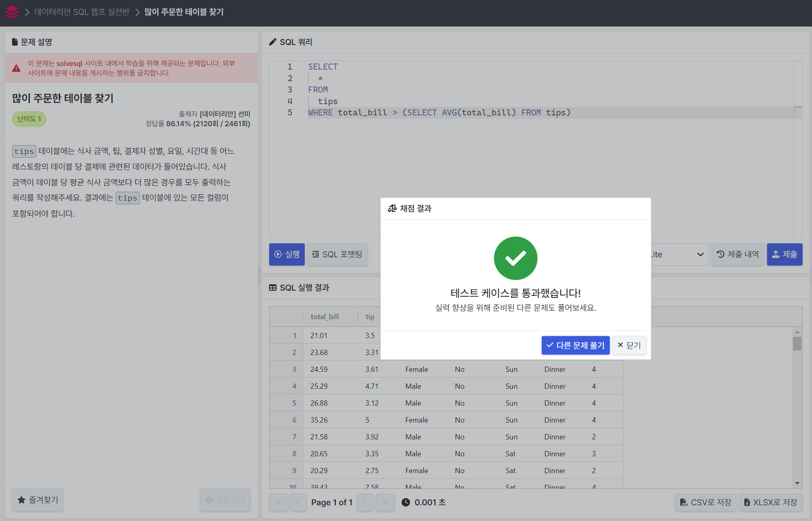

# 15.2.15 Subqueries
[공식문서](https://dev.mysql.com/doc/refman/8.0/en/subqueries.html)

- Subqueries provide alternative ways to perform operations that would otherwise require complex joins and unions.

- Subqueries using VALUES are generally more verbose versions of subqueries that can be rewritten more compactly using set notation, or with SELECT or TABLE syntax; assuming that table ts is created using the statement CREATE TABLE ts VALUES ROW(2), ROW(4), ROW(6), the statements shown here are all equivalent:

```
SELECT * FROM tt
    WHERE b > ANY (VALUES ROW(2), ROW(4), ROW(6));

SELECT * FROM tt
    WHERE b > ANY (SELECT * FROM ts);

SELECT * FROM tt
    WHERE b > ANY (TABLE ts);
```

## 15.2.15.2. Comparisons Using Subqueries

### COMPARISON_OPERATOR
```
=  >  <  >=  <=  <>  !=  <=>
```

### COMMON USE FORM:
```
non_subquery_operand comparison_operator (subquery)

EX.

WHERE 'a' = (SELECT column1 FROM t1)
```
### MYSQL
```
non_subquery_operand LIKE (subquery)

EX.

SELECT * FROM t1
  WHERE column1 = (SELECT MAX(column2) FROM t2);
```

### CAUTION
- For a comparison of the subquery to a scalar, the subquery must return a scalar.
- For a comparison of the subquery to a row constructor, the subquery must be a row subquery that returns a row with the same number of values as the row constructor.

## 15.2.15.3. Subqueries with ANY, IN or SOME
```
- SELECT s1 FROM t1 WHERE s1 = ANY (SELECT s1 FROM t2);
- SELECT s1 FROM t1 WHERE s1 IN    (SELECT s1 FROM t2);
```
```
- SELECT s1 FROM t1 WHERE s1 <> ANY  (SELECT s1 FROM t2);
- SELECT s1 FROM t1 WHERE s1 <> SOME (SELECT s1 FROM t2);
```

### SOME
- “a is not equal to any b” means “there is no b which is equal to a,” but in SQL, syntax means “there is some b to which a is not equal.”

## 15.2.15.4. Subqueries with ALL
- The word ALL, which must follow a comparison operator, means “return TRUE if the comparison is TRUE for ALL of the values in the column that the subquery returns.”
```
SELECT s1 FROM t1 WHERE s1 <> ALL (SELECT s1 FROM t2);
SELECT s1 FROM t1 WHERE s1 NOT IN (SELECT s1 FROM t2);
```

## 15.2.15.6. Subqueries with EXISTS or NOT EXISTS
- If a subquery returns any rows at all, EXISTS subquery is TRUE, and NOT EXISTS subquery is FALSE.

- What kind of store is present in all cities?
```
SELECT DISTINCT store_type FROM stores
  WHERE NOT EXISTS (
    SELECT * FROM cities WHERE NOT EXISTS (
      SELECT * FROM cities_stores
       WHERE cities_stores.city = cities.city
       AND cities_stores.store_type = stores.store_type));
```

### 쿼리 분석
- 목표 : "모든 도시에서 운영되는 store_type"을 찾는 것!

1. 가장 안쪽 서브쿼리
```
SELECT * FROM cities_stores
WHERE cities_stores.city = cities.city
AND cities_stores.store_type = stores.store_type
```
- cities.city에 대해 stores.store_type이 존재하는지 확인

2. 중간 서브쿼리(NOT EXISTS)
```
SELECT * FROM cities 
WHERE NOT EXISTS (
    SELECT * FROM cities_stores
    WHERE cities_stores.city = cities.city
    AND cities_stores.store_type = stores.store_type
)
```
- NOT EXISTS() : 현재 store_type이 존재하지 않는 도시를 반환
- 즉, 어떤 도시라도 stores.store_type이 존재하지 않으면, cities 테이블에서 해당 도시가 반환

3. 최종 쿼리(WHERE NOT EXISTS)
```
SELECT DISTINCT store_type 
FROM stores
WHERE NOT EXISTS (
    SELECT * FROM cities 
    WHERE NOT EXISTS (
        SELECT * FROM cities_stores
        WHERE cities_stores.city = cities.city
        AND cities_stores.store_type = stores.store_type
    )
);
```
- 최종적으로 NOT EXISTS를 통해 모든 도시에 존재하지 않는 store_type을 제외하여 모든 도시에 존재하는 store_type만 선택된다!!


## 15.2.15.10. Subquery Errors
- For transactional storage engines, the failure of a subquery causes the entire statement to fail.

<br>

# 문제 풀이

## 1. 많이 주문한 테이블 찾기
[문제링크](https://solvesql.com/problems/find-tables-with-high-bill/)



```
SELECT
  *
FROM
  tips
WHERE total_bill > (SELECT AVG(total_bill) FROM tips)
```

## 2. 레스토랑의 대목
[문제링크](https://solvesql.com/problems/high-season-of-restaurant/)


```
WITH ST AS (
    SELECT day, SUM(total_bill) AS total_sales
    FROM tips
    GROUP BY day
    HAVING SUM(total_bill) >= 1500
)

SELECT t.*
FROM tips t
JOIN ST ON ST.day = t.day;
```

## 3. 식품분류별 가장 비싼 식품의 정보 조회하기
[문제링크](https://school.programmers.co.kr/learn/courses/30/lessons/131116)


### 서브쿼리 방식
```
SELECT
  CATEGORY,
  PRICE AS MAX_PRICE,
  PRODUCT_NAME
FROM
  FOOD_PRODUCT
WHERE
  PRICE IN (
    SELECT
      MAX(PRICE)
    FROM
      FOOD_PRODUCT
    GROUP BY
      CATEGORY
  )
  AND CATEGORY IN ('과자', '국', '김치', '식용유')
ORDER BY
  PRICE DESC;
```

### WITH문 방식
```
WITH
  MF AS (
    SELECT
      CATEGORY,
      MAX(PRICE) AS MAX_PRICE
    FROM
      FOOD_PRODUCT
    GROUP BY
      CATEGORY
  )
SELECT
  F.CATEGORY,
  MF.MAX_PRICE AS MAX_PRICE,
  F.PRODUCT_NAME
FROM
  FOOD_PRODUCT AS F
  JOIN MF ON MF.CATEGORY = F.CATEGORY
  AND MF.MAX_PRICE = F.PRICE
WHERE
  F.CATEGORY IN ('과자', '국', '김치', '식용유')
ORDER BY
  MF.MAX_PRICE DESC;
```

> ```MF.MAX_PRICE AS MAX_PRICE``` 대신에 ```F.PRICE AS MAX_PRICE```를 이용하는 것이 보다 더 직관적일 수 있다!!

### 서브쿼리 방식과 WITH문 방식 차이 분석

서브쿼리 방식의 경우 같은 코드를 여러 번 쓰게 될 경우 코드의 가독성이 안좋아질 수 있다. 또한, 서브쿼리의 실행마다 계산이 이뤄져 성능의 비효율을 야기할 수 있다.

반면, WITH문(CTE) 방식의 경우 CTE가 내부적으로 임시 테이블처럼 활용될 수 있어 성능 면에서 유리하다. 따라서 동일 서브쿼리를 여러 번 써야 하는 경우 또는 여러 개의 테이블을 JOIN해야하는 경우 등에 WITH문(CTE) 방식이 더 유리하다.

> 다만 개인적으로 서브쿼리가 하나의 코드로 쭉 이어서 쓸 수 있는 반면, WITH문의 경우 따로 테이블에 대한 정의를 내려줘야한다는 점에서 간단한 쿼리를 짤 때는 서브쿼리를 애용합니다...ㅎㅎㅎㅎ

