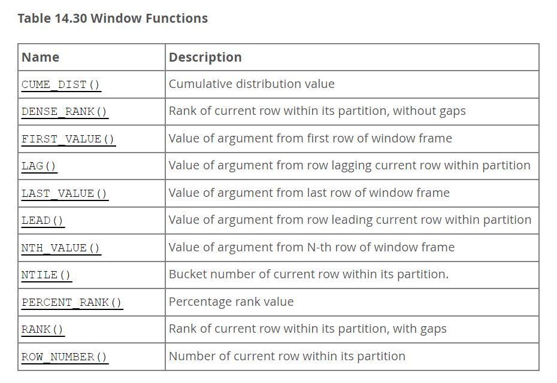
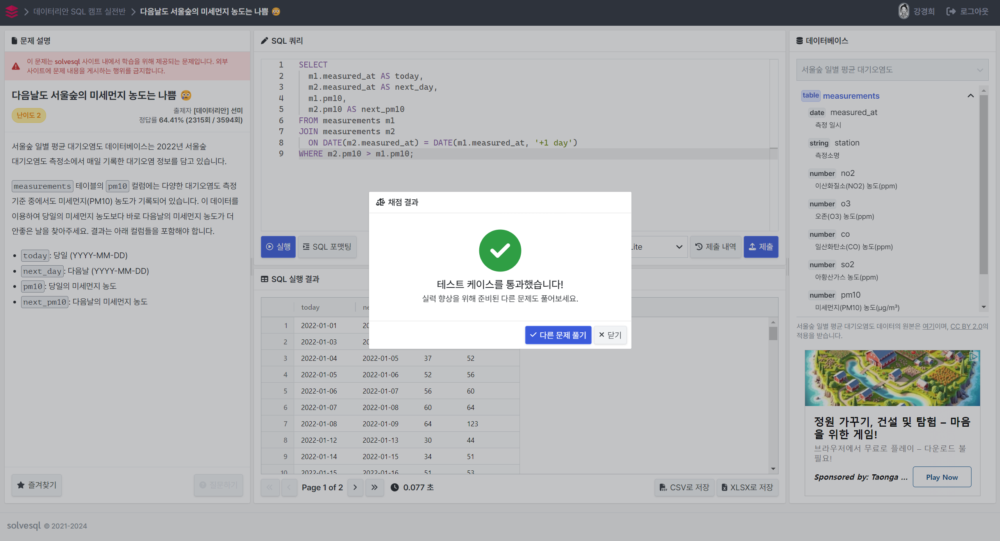
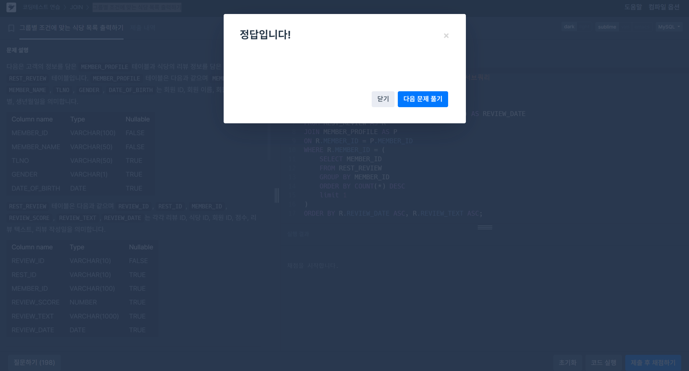

# SQL 개념정리 - 공식문서 참고
## 14.20.2 Window Function Concepts and Syntax
[공식문서](https://dev.mysql.com/doc/refman/8.0/en/window-functions-usage.html)

- A window function performs an aggregate-like operation on a set of query rows.
-  However, whereas an aggregate operation groups query rows into a single result row,
a window function produces a result for each query row.
- window operations do not collapse groups of query rows to a single output row.
Instead, they produce a result for each row.

```SQL
mysql> SELECT
         year, country, product, profit,
         SUM(profit) OVER() AS total_profit,
         SUM(profit) OVER(PARTITION BY country) AS country_profit
       FROM sales
       ORDER BY country, year, product, profit;

+------+---------+------------+--------+--------------+----------------+
| year | country | product    | profit | total_profit | country_profit |
+------+---------+------------+--------+--------------+----------------+
| 2000 | Finland | Computer   |   1500 |         7535 |           1610 |
| 2000 | Finland | Phone      |    100 |         7535 |           1610 |
| 2001 | Finland | Phone      |     10 |         7535 |           1610 |
| 2000 | India   | Calculator |     75 |         7535 |           1350 |
| 2000 | India   | Calculator |     75 |         7535 |           1350 |
| 2000 | India   | Computer   |   1200 |         7535 |           1350 |
| 2000 | USA     | Calculator |     75 |         7535 |           4575 |
| 2000 | USA     | Computer   |   1500 |         7535 |           4575 |
| 2001 | USA     | Calculator |     50 |         7535 |           4575 |
| 2001 | USA     | Computer   |   1200 |         7535 |           4575 |
| 2001 | USA     | Computer   |   1500 |         7535 |           4575 |
| 2001 | USA     | TV         |    100 |         7535 |           4575 |
| 2001 | USA     | TV         |    150 |         7535 |           4575 |
+------+---------+------------+--------+--------------+----------------+
```

### nonaggregate function
- uses ROW_NUMBER()
- it produces the row number of each row within its partition.

> NOTE : Partitioning for window functions differs from table partitioning.

- ROW_NUMBER() over_clause
	- To assign peers the same value, use RANK() or DENSE_RANK().
	- Returns the number of the current row within its partition.

## 14.20.1 Window Function Descriptions
[공식문서](https://dev.mysql.com/doc/refman/8.0/en/window-function-descriptions.html)

### [Table 14.30] Window Functions 




- CUME_DIST() over_clause
	- Returns the cumulative distribution of a value within a group of values.
	- the percentage of partition values less than or equal to the value in the current row.
	- This function should be used with ORDER BY to sort partition rows into the desired order.

```SQL
mysql> SELECT
         val,
         ROW_NUMBER()   OVER w AS 'row_number',
         CUME_DIST()    OVER w AS 'cume_dist',
         PERCENT_RANK() OVER w AS 'percent_rank'
       FROM numbers
       WINDOW w AS (ORDER BY val);
+------+------------+--------------------+--------------+
| val  | row_number | cume_dist          | percent_rank |
+------+------------+--------------------+--------------+
|    1 |          1 | 0.2222222222222222 |            0 |
|    1 |          2 | 0.2222222222222222 |            0 |
|    2 |          3 | 0.3333333333333333 |         0.25 |
|    3 |          4 | 0.6666666666666666 |        0.375 |
|    3 |          5 | 0.6666666666666666 |        0.375 |
|    3 |          6 | 0.6666666666666666 |        0.375 |
|    4 |          7 | 0.8888888888888888 |         0.75 |
|    4 |          8 | 0.8888888888888888 |         0.75 |
|    5 |          9 |                  1 |            1 |
+------+------------+--------------------+--------------+
```

- DENSE_RANK() over_clause
	- Returns the cumulative distribution of a value within a group of values.
	- Peers are considered ties and receive the same rank.


- LAG(expr [, N[, default]]) [null_treatment] over_clause
	- Returns the value of expr from the row that lags (precedes) the current row by N rows within its partition.

- LEAD(expr [, N[, default]]) [null_treatment] over_clause
	- Returns the value of expr from the row that leads (follows) the current row by N rows within its partition.

- RANK() over_clause
	- Returns the rank of the current row within its partition, with gaps.
	- the result is noncontiguous rank numbers.

### 최종 비교 쿼리
```SQL
mysql> SELECT
         val,
         ROW_NUMBER() OVER w AS 'row_number',
         RANK()       OVER w AS 'rank',
         DENSE_RANK() OVER w AS 'dense_rank'
       FROM numbers
       WINDOW w AS (ORDER BY val);
+------+------------+------+------------+
| val  | row_number | rank | dense_rank |
+------+------------+------+------------+
|    1 |          1 |    1 |          1 |
|    1 |          2 |    1 |          1 |
|    2 |          3 |    3 |          2 |
|    3 |          4 |    4 |          3 |
|    3 |          5 |    4 |          3 |
|    3 |          6 |    4 |          3 |
|    4 |          7 |    7 |          4 |
|    4 |          8 |    7 |          4 |
|    5 |          9 |    9 |          5 |
+------+------------+------+------------+
```


## 14.19.1 Aggregate Function Descriptions
[공식문서](https://dev.mysql.com/doc/refman/8.0/en/aggregate-functions.html)

<BR>


# 문제풀이
##  1. LeetCode - Rank Scores (DENSE_RANK())
[문제링크](https://leetcode.com/problems/rank-scores/description/)


- scores에 대해서 내림차순 정렬
- dense_rank() 이용
- order by score desc;

```SQL
SELECT 
  score,
  DENSE_RANK() OVER (ORDER BY score DESC) AS 'rank'
FROM Scores;
```

신박한 오류였던 것이 'rank'로 입력해야한다는 점이었다.
기존 프로그래머스에서는 rank로 바로 써줘도 오류가 안났었는데, 이 프로그램에서는 예약어 rank와 구분해주기 위해 문자로 확실히 설정해주는 것이 좋은 피드백? 이었던 것 같다!


## 2. 다음날도 서울숲의 미세먼지 농도는 나쁨 😢
[문제링크](https://solvesql.com/problems/bad-finedust-measure/)

### SOL1(날짜 직접 지정)


```SQL
SELECT 
  m1.measured_at AS today,
  m2.measured_at AS next_day,
  m1.pm10,
  m2.pm10 AS next_pm10
FROM measurements m1
JOIN measurements m2
  ON DATE(m2.measured_at) = DATE(m1.measured_at, '+1 day')
WHERE m2.pm10 > m1.pm10;
```

### SOL2 (LEAD함수 이용)


```SQL
SELECT *
FROM (
  SELECT
    measured_at AS today,
    LEAD(measured_at) OVER (ORDER BY measured_at) AS next_day,
    pm10,
    LEAD(pm10) OVER (ORDER BY measured_at) AS next_pm10
  FROM measurements
) AS t
WHERE julianday(next_day) - julianday(today) = 1
  AND next_pm10 > pm10;
```


## 3. 그룹별 조건에 맞는 식당 목록 출력하기
[문제링크](https://school.programmers.co.kr/learn/courses/30/lessons/131124)



### 서브쿼리 방식
```SQL
SELECT 
    P.MEMBER_NAME,
    R.REVIEW_TEXT,
    DATE_FORMAT(R.REVIEW_DATE, '%Y-%m-%d') AS REVIEW_DATE
FROM REST_REVIEW AS R
JOIN MEMBER_PROFILE AS P
ON R.MEMBER_ID = P.MEMBER_ID
WHERE R.MEMBER_ID = (
    SELECT MEMBER_ID 
    FROM REST_REVIEW 
    GROUP BY MEMBER_ID
    ORDER BY COUNT(*) DESC
    limit 1
)
ORDER BY R.REVIEW_DATE ASC, R.REVIEW_TEXT ASC;
```

### 윈도우 함수 방식
```SQL
WITH RR AS (
  SELECT *,
  COUNT(*) OVER (PARTITION BY MEMBER_ID) AS CNT
  FROM REST_REVIEW
),
MAX_CNT AS (
  SELECT MAX(CNT) AS MAX_REVIEW_CNT
  FROM (
    SELECT COUNT(*) AS CNT
    FROM REST_REVIEW
    GROUP BY MEMBER_ID
  ) AS T
)
SELECT 
    P.MEMBER_NAME,
    RR.REVIEW_TEXT,
    DATE_FORMAT(RR.REVIEW_DATE, '%Y-%m-%d') AS REVIEW_DATE
FROM RR
JOIN MEMBER_PROFILE P ON RR.MEMBER_ID = P.MEMBER_ID
JOIN MAX_CNT ON RR.CNT = MAX_CNT.MAX_REVIEW_CNT
ORDER BY RR.REVIEW_DATE, RR.REVIEW_TEXT;
```

사실 이 문제는 개인적으로 윈도우 함수 방식보다는 서브쿼리 방식이 가장 간단하고 편하게 쓸 수 있었던 것 같은데요,, 그래도 즐거웠답니다~!