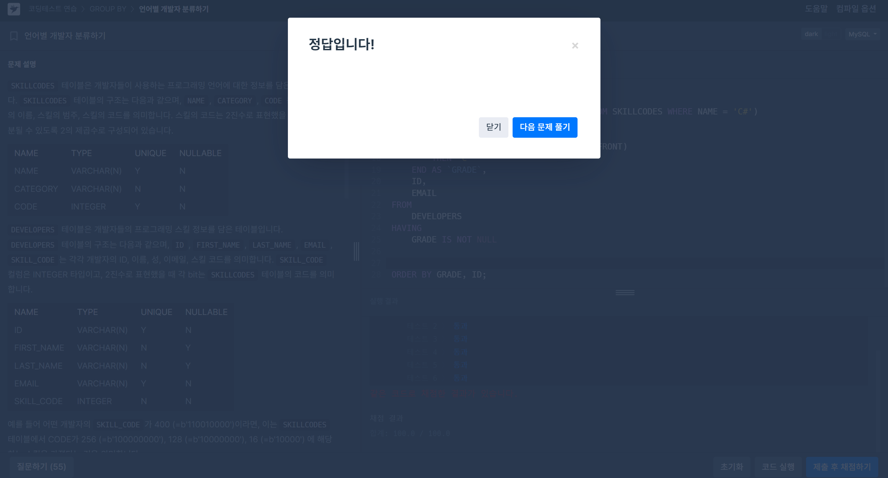

# SQL 개념정리 - 공식문서 참고
## 15.2.13.2 JOIN Clause
[공식문서](https://dev.mysql.com/doc/refman/8.0/en/join.html)

```SQL
- SELECT * FROM t1 LEFT JOIN (t2, t3, t4)
                 ON (t2.a = t1.a AND t3.b = t1.b AND t4.c = t1.c)

- SELECT * FROM t1 LEFT JOIN (t2 CROSS JOIN t3 CROSS JOIN t4)
                 ON (t2.a = t1.a AND t3.b = t1.b AND t4.c = t1.c)                 
```

- INNER JOIN and , (comma) are semantically equivalent in the absence of a join condition: both produce a Cartesian product between the specified tables (that is, each and every row in the first table is joined to each and every row in the second table).

```SQL
a LEFT JOIN b USING (c1, c2, c3)
```
- The USING(join_column_list) clause names a list of columns that must exist in both tables. If tables a and b both contain columns c1, c2, and c3, the following join compares corresponding columns from the two tables:

```SQL
SELECT left_tbl.*
    FROM { OJ left_tbl LEFT OUTER JOIN right_tbl
           ON left_tbl.id = right_tbl.id }
    WHERE right_tbl.id IS NULL;
```
- You can use other types of joins within { OJ ... }, such as INNER JOIN or RIGHT OUTER JOIN. This helps with compatibility with some third-party applications, but is not official ODBC syntax.

```SQL
a LEFT JOIN b USING (c1, c2, c3)
a LEFT JOIN b ON a.c1 = b.c1 AND a.c2 = b.c2 AND a.c3 = b.c3
```

- With respect to determining which rows satisfy the join condition, both joins are semantically identical.

- With respect to determining which columns to display for SELECT * expansion, the two joins are not semantically identical. The USING join selects the coalesced value of corresponding columns, whereas the ON join selects all columns from all tables.

# 문제풀이
##  1. 저자 별 카테고리 별 매출액 집계하기
[문제링크](https://school.programmers.co.kr/learn/courses/30/lessons/144856)


```SQL
SELECT
  B.AUTHOR_ID,
  A.AUTHOR_NAME,
  CATEGORY,
  SUM(PRICE * SALES) AS TOTAL_SALES
FROM
  BOOK AS B
  JOIN AUTHOR AS A ON B.AUTHOR_ID = A.AUTHOR_ID
  JOIN BOOK_SALES AS S ON B.BOOK_ID = S.BOOK_ID
WHERE
  DATE_FORMAT(SALES_DATE, '%Y-%m') = '2022-01'
GROUP BY
  B.AUTHOR_ID,
  CATEGORY
ORDER BY
  B.AUTHOR_ID ASC,
  CATEGORY DESC;
```

# SQL 개념정리 - 공식문서 참고
## 14.19.3 MySQL Handling of GROUP BY

- Basic SQL Standards and GROUP BY
  - SQL-92 does not allow nonaggregated columns in SELECT, HAVING, or ORDER BY unless they appear in the GROUP BY clause.
  - For example, this query is illegal in SQL-92 because name is not aggregated and not grouped:
```SQL
SELECT o.custid, c.name, MAX(o.payment)
FROM orders AS o, customers AS c
WHERE o.custid = c.custid
GROUP BY o.custid;
```


- SQL:1999 and Functional Dependence
  - SQL:1999 allows nonaggregated columns if they are functionally dependent on GROUP BY columns.
  - Example: if custid is the primary key, then name is functionally dependent and the query is valid.

- Aliases in HAVING Clause
  - MySQL allows aliases in HAVING, even though standard SQL does not:
```SQL
SELECT name, COUNT(name) AS c
FROM orders
GROUP BY name
HAVING c = 1;
```

- Noncolumn Expressions in GROUP BY
  - Standard SQL only allows columns in GROUP BY.

  - MySQL permits expressions like FLOOR(value/100):
```SQL
SELECT id, FLOOR(value/100)
FROM tbl_name
GROUP BY id, FLOOR(value/100);
```

- Aliases in GROUP BY
  - MySQL allows using column aliases in GROUP BY:
```SQL
SELECT id, FLOOR(value/100) AS val
FROM tbl_name
GROUP BY id, val;
```

MySQL does not detect functional dependence for expressions.
Fix: use a derived table:
```SQL
SELECT id, F, id + F
FROM (
  SELECT id, FLOOR(value/100) AS F
  FROM tbl_name
  GROUP BY id, FLOOR(value/100)
) AS dt;
```

## 15.2.13 SELECT Statement

- Evaluation Timing
  - HAVING is applied almost last, right before results are sent to the client.
  - LIMIT is applied after HAVING.

### 📌 SQL Standard vs MySQL Extension
- Standard SQL: HAVING can reference only GROUP BY columns or aggregates.

- MySQL allows: 
    - Using aliases from the SELECT list in HAVING.
    - Referring to columns from outer subqueries.

### ⚠️ Important Cautions
Do not use HAVING for filtering individual rows. Use WHERE instead.

❌ Incorrect:

```SQL
SELECT col_name FROM tbl_name HAVING col_name > 0;
```

✅ Correct:

```SQL
SELECT col_name FROM tbl_name WHERE col_name > 0;
```
### ⚠️ Ambiguity in HAVING
If a column name is used as both an alias and a real column, ambiguity arises.

```SQL
SELECT COUNT(col1) AS col2 FROM t GROUP BY col2 HAVING col2 = 2;
```

MySQL prioritizes the column in the GROUP BY clause in such cases.


# 문제풀이
##  2. 언어별 개발자 분류하기
[문제링크](https://school.programmers.co.kr/learn/courses/30/lessons/276036)



```SQL
WITH FRONT AS (
    SELECT SUM(CODE)
    FROM SKILLCODES
    WHERE CATEGORY = 'Front End'
)

SELECT
    CASE 
        WHEN SKILL_CODE & (SELECT * FROM FRONT) 
            AND SKILL_CODE & (SELECT CODE FROM SKILLCODES WHERE NAME = 'python')
        THEN 'A'
        
        WHEN SKILL_CODE & (SELECT CODE FROM SKILLCODES WHERE NAME = 'C#')
        THEN 'B'
        
        WHEN SKILL_CODE & (SELECT * FROM FRONT)
        THEN 'C'
    END AS `GRADE`, 
    ID,
    EMAIL
FROM
    DEVELOPERS
HAVING
    GRADE IS NOT NULL


ORDER BY GRADE, ID;
```