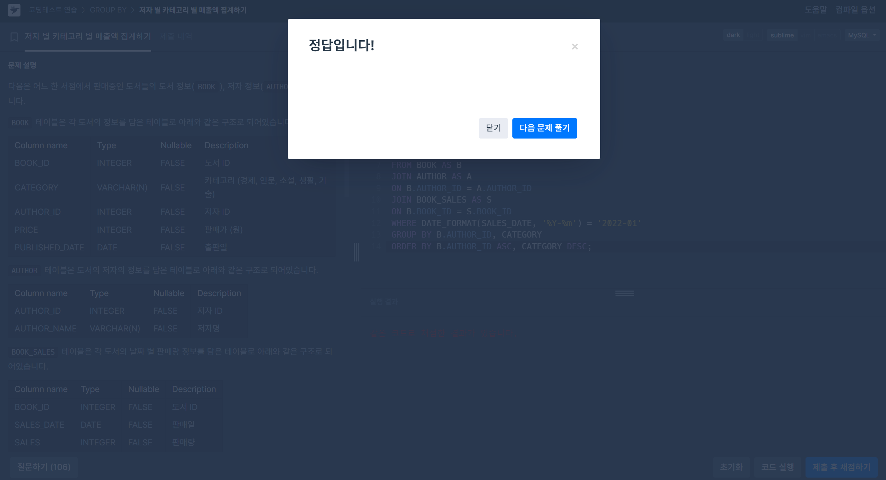

# SQL 개념정리 - 공식문서 참고
## 15.2.13.2 JOIN Clause
[공식문서](https://dev.mysql.com/doc/refman/8.0/en/join.html)

```SQL
- SELECT * FROM t1 LEFT JOIN (t2, t3, t4)
                 ON (t2.a = t1.a AND t3.b = t1.b AND t4.c = t1.c)

- SELECT * FROM t1 LEFT JOIN (t2 CROSS JOIN t3 CROSS JOIN t4)
                 ON (t2.a = t1.a AND t3.b = t1.b AND t4.c = t1.c)                 
```

- INNER JOIN and , (comma) are semantically equivalent in the absence of a join condition: both produce a Cartesian product between the specified tables (that is, each and every row in the first table is joined to each and every row in the second table).

```SQL
a LEFT JOIN b USING (c1, c2, c3)
```
- The USING(join_column_list) clause names a list of columns that must exist in both tables. If tables a and b both contain columns c1, c2, and c3, the following join compares corresponding columns from the two tables:

```SQL
SELECT left_tbl.*
    FROM { OJ left_tbl LEFT OUTER JOIN right_tbl
           ON left_tbl.id = right_tbl.id }
    WHERE right_tbl.id IS NULL;
```
- You can use other types of joins within { OJ ... }, such as INNER JOIN or RIGHT OUTER JOIN. This helps with compatibility with some third-party applications, but is not official ODBC syntax.

```SQL
a LEFT JOIN b USING (c1, c2, c3)
a LEFT JOIN b ON a.c1 = b.c1 AND a.c2 = b.c2 AND a.c3 = b.c3
```

- With respect to determining which rows satisfy the join condition, both joins are semantically identical.

- With respect to determining which columns to display for SELECT * expansion, the two joins are not semantically identical. The USING join selects the coalesced value of corresponding columns, whereas the ON join selects all columns from all tables.

# 문제풀이
##  1. 저자 별 카테고리 별 매출액 집계하기
[문제링크](https://school.programmers.co.kr/learn/courses/30/lessons/144856)



```SQL
SELECT
  B.AUTHOR_ID,
  A.AUTHOR_NAME,
  CATEGORY,
  SUM(PRICE * SALES) AS TOTAL_SALES
FROM
  BOOK AS B
  JOIN AUTHOR AS A ON B.AUTHOR_ID = A.AUTHOR_ID
  JOIN BOOK_SALES AS S ON B.BOOK_ID = S.BOOK_ID
WHERE
  DATE_FORMAT(SALES_DATE, '%Y-%m') = '2022-01'
GROUP BY
  B.AUTHOR_ID,
  CATEGORY
ORDER BY
  B.AUTHOR_ID ASC,
  CATEGORY DESC;
```
