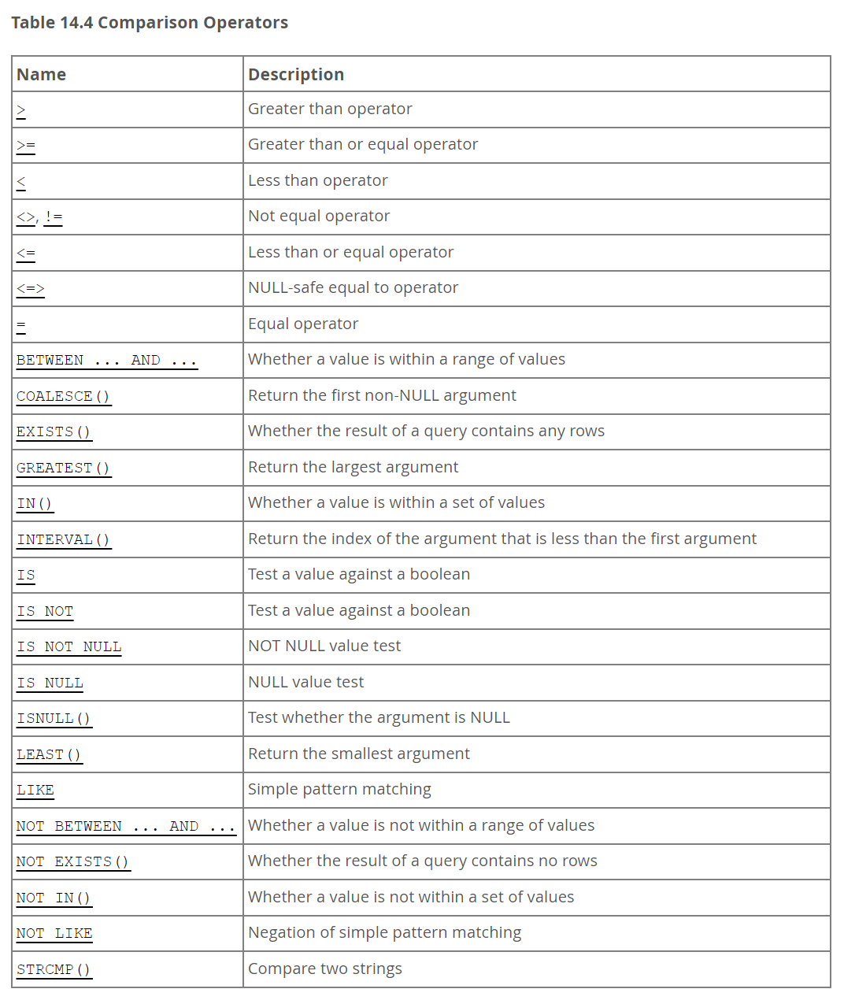

# 14.5 Flow Control Functions

IF(expr1, expr2, expr3)
- expr1이 TRUE면 expr2, FALSE면 expr3 반환

```SQL
SELECT IF(1 < 2, 'yes', 'no');
```

💡 반환 타입

- 문자열이 하나라도 있으면 → 문자열
- 실수가 있으면 → 실수
- 정수만 있으면 → 정수
- NULL은 무시됨

# 14.4.2 Comparison Functions and Operators



```SQL
GREATEST(value1,value2,...)
```

- With two or more arguments, returns the largest (maximum-valued) argument. The arguments are compared using the same rules as for LEAST().

```SQL
mysql> SELECT LEAST(2,0);
        -> 0
mysql> SELECT LEAST(34.0,3.0,5.0,767.0);
        -> 3.0
mysql> SELECT LEAST('B','A','C');
        -> 'A'
```

- The return type of LEAST() is the aggregated type of the comparison argument types.

```SQL
SELECT LEAST(1, NULL, 3); -- NULL

SELECT LEAST(5, 2, 9); -- 2

SELECT LEAST(3, CAST('2.5' AS DECIMAL), 4); -- 2.5

SELECT LEAST(100, '2'); -- '100' < '2' → 결과는 '100'

SELECT LEAST('apple', 'banana', 'cat'); -- 'apple'

SELECT LEAST(BINARY 'a', BINARY 'A'); -- 결과: 'A' (ASCII 65 < 97)
```
<br>

# 문제풀이
##  1. 삼각형 종류 분류하기

[문제링크](https://www.hackerrank.com/challenges/what-type-of-triangle/problem)

```SQL
SELECT
    CASE
        WHEN A + B <= C OR A + C <= B OR B + C <= A THEN 'Not A Triangle'
        WHEN A = B AND B = C THEN 'Equilateral'
        WHEN A = B OR B = C OR C = A THEN 'Isosceles'
        ELSE 'Scalene'
    END
FROM TRIANGLES
```

## 2. Find Customer Referee

[문제링크](https://leetcode.com/problems/find-customer-referee/description/)

```SQL
SELECT
    name
FROM Customer
WHERE
    referee_id IS NULL 
    OR referee_id <> 2
```