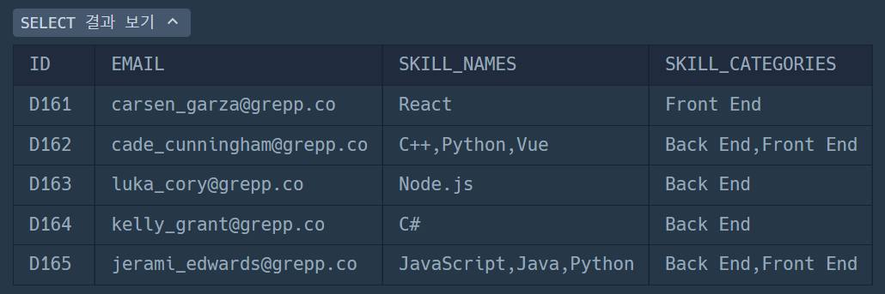

# with_recursive
# group_concat()

## group_concat(expr)
- distinct : 중복된 값 제거
- order by : 결합될 값 정렬
- separator : 다른 구분자 지정이 가능, 공백 없이 붙이려면 ' '

- 결과 길이 제한
	- 결과 문자열의 최대 길이 : group_concat_max_len의 값에 의해 제한됨.
	- 더 긴 문자열을 허용하려면 해당 값을 늘릴 수 있으며, 최종 한계는 max_allowed_packer에 의해 제한됨.

```SQL
SET SESSION group_concat_max_len = 10000;
```

- concat_ws(separator, str1, str2...)
	- 구분자를 지정하여 문자열 연결
- jason_arrayagg(co1_or_exp[over (...)]
	- 배열 요소의 순서는 정의되지 않음.
	- null 값 포함 시 null 요소가 포함됨.


## Recursive Common Table Expressions
```SQL
WITH RECURSIVE cte (n) AS
(
  SELECT 1
  UNION ALL
  SELECT n + 1 FROM cte WHERE n < 5
)
SELECT * FROM cte;
```

- The WITH clause must begin with WITH RECURSIVE if any CTE in the WITH clause refers to itself. 

```SQL
SELECT ...      -- return initial row set
UNION ALL
SELECT ...      -- return additional row sets
```

- If the nonrecursive and recursive parts are separated by UNION DISTINCT, duplicate rows are eliminated. This is useful for queries that perform transitive closures, to avoid infinite loops.
- 재귀 SELECT에서는 다음 SQL 구성요소를 사용할 수 없다.
	- GROUP BY, ORDER BY, DISTINCT, 집계 함수, 윈도우 함수

1. 숫자 시퀀스 생성
```SQL
WITH RECURSIVE seq (n) AS (
  SELECT 1
  UNION ALL
  SELECT n + 1 FROM seq WHERE n < 5
)
SELECT * FROM seq;
```

2. 피보나치 수열
```SQL
WITH RECURSIVE fib (n, a, b) AS (
  SELECT 1, 0, 1
  UNION ALL
  SELECT n + 1, b, a + b FROM fib WHERE n < 10
)
SELECT * FROM fib;
```

3. 날짜 시리즈 생성
```SQL
WITH RECURSIVE dates (d) AS (
  SELECT DATE('2023-01-01')
  UNION ALL
  SELECT d + INTERVAL 1 DAY FROM dates WHERE d < '2023-01-07'
)
SELECT * FROM date
```

4. 조직도 탐색(트리 구조)
```SQL
WITH RECURSIVE org (id, name, path) AS (
  SELECT id, name, CAST(id AS CHAR(200)) FROM employees WHERE manager_id IS NULL
  UNION ALL
  SELECT e.id, e.name, CONCAT(o.path, ',', e.id)
  FROM org o JOIN employees e ON o.id = e.manager_id
)
SELECT * FROM org ORDER BY path;
```

종료 조건을 명확히 설정하고, 깊이 제한이나 실행 시간 제한을 설정해야한다.


# 문제 풀이
## 1. 우유와 요거트가 담긴 장바구니

### sol1. 일반적인 방식
```SQL
WITH MILK_CART AS (
SELECT
CART_ID
FROM CART_PRODUCTS
WHERE NAME = 'Milk'),

YOGURT_CART AS (
SELECT
CART_ID
FROM CART_PRODUCTS
WHERE NAME = 'Yogurt')

SELECT
M.CART_ID
FROM MILK_CART AS M
JOIN YOGURT_CART AS Y
ON M.CART_ID = Y.CART_ID
GROUP BY M.CART_ID
ORDER BY M.CART_ID ASC;
```
### sol2. group_concat을 활용한 방식
```SQL
WITH CART_GROUPED AS (
  SELECT
    CART_ID,
    GROUP_CONCAT(NAME) AS PRODUCT_LIST
  FROM CART_PRODUCTS
  GROUP BY CART_ID
)

SELECT
  CART_ID
FROM CART_GROUPED
WHERE PRODUCT_LIST LIKE '%Milk%'
  AND PRODUCT_LIST LIKE '%Yogurt%'
ORDER BY CART_ID ASC;
```

## 2. 언어별 개발자 분류하기

### original_sol
```SQL
WITH FRONT AS (
    SELECT SUM(CODE)
    FROM SKILLCODES
    WHERE CATEGORY = 'Front End'
)

SELECT
    CASE 
        WHEN SKILL_CODE & (SELECT * FROM FRONT) 
            AND SKILL_CODE & (SELECT CODE FROM SKILLCODES WHERE NAME = 'python')
        THEN 'A'
        
        WHEN SKILL_CODE & (SELECT CODE FROM SKILLCODES WHERE NAME = 'C#')
        THEN 'B'
        
        WHEN SKILL_CODE & (SELECT * FROM FRONT)
        THEN 'C'
    END AS `GRADE`, 
    ID,
    EMAIL
FROM
    DEVELOPERS
HAVING
    GRADE IS NOT NULL


ORDER BY GRADE, ID;
```

### new_sol

```SQL
SELECT
  D.ID,
  D.EMAIL,
  GROUP_CONCAT(S.NAME ORDER BY S.CODE) AS SKILL_NAMES,
  GROUP_CONCAT(DISTINCT S.CATEGORY ORDER BY S.CATEGORY) AS SKILL_CATEGORIES
FROM DEVELOPERS D
JOIN SKILLCODES S
  ON (D.SKILL_CODE & S.CODE) != 0
GROUP BY D.ID, D.EMAIL
ORDER BY D.ID;
```

## 3. 입양 시각 구하기(2)
```SQL
WITH RECURSIVE HT AS (
SELECT 
0 AS HOUR
UNION ALL
SELECT HOUR +1 FROM HT WHERE HOUR<23)

SELECT
HT.HOUR,
COALESCE(COUNT(O.ANIMAL_ID), 0) AS COUNT
FROM HT
LEFT JOIN ANIMAL_OUTS AS O
ON HT.HOUR = HOUR(O.DATETIME)
GROUP BY HT.HOUR
ORDER BY HT.HOUR ASC;
```


