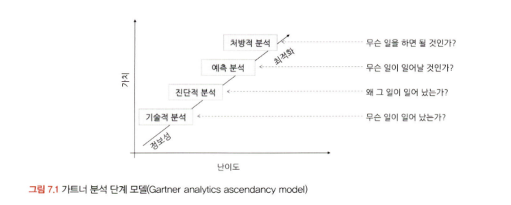

# 통계학 2주차 정규과제

📌통계학 정규과제는 매주 정해진 분량의 『*데이터 분석가가 반드시 알아야 할 모든 것*』 을 읽고 학습하는 것입니다. 이번 주는 아래의 **Statistics_2nd_TIL**에 나열된 분량을 읽고 `학습 목표`에 맞게 공부하시면 됩니다.

아래의 문제를 풀어보며 학습 내용을 점검하세요. 문제를 해결하는 과정에서 개념을 스스로 정리하고, 필요한 경우 추가자료와 교재를 다시 참고하여 보완하는 것이 좋습니다.

2주차는 `1부. 데이터 기초체력 기르기`를 읽고 새롭게 배운 내용을 정리해주시면 됩니다.


## Statistics_2nd_TIL

### 1부. 데이터 기초체력 기르기
### 06. 확률분포
### 07. 가설검정

## Study Schedule

|주차 | 공부 범위     | 완료 여부 |
|----|----------------|----------|
|1주차| 1부 p.2~56     | ✅      |
|2주차| 1부 p.57~79    | ✅      | 
|3주차| 2부 p.82~120   | 🍽️      | 
|4주차| 2부 p.121~202  | 🍽️      | 
|5주차| 2부 p.203~254  | 🍽️      | 
|6주차| 3부 p.300~356  | 🍽️      | 
|7주차| 3부 p.357~615  | 🍽️      |

<!-- 여기까진 그대로 둬 주세요-->

# 06. 확률분포

```
✅ 학습 목표 :
* 이산확률분포의 종류와 특징을 설명할 수 있다.
* 연속확률분포의 종류와 특징을 설명할 수 있다. 
* 중심극한정리(CLT)의 개념을 이해하고 설명 할 수 있다.
```

## 6.2. 이산확률분포

> **🧚 이산확률분포에 대해 학습한 내용을 정리해주세요.**

<!--수식과 공식을 암기하기보다는 분포의 개념과 특성을 위주로 공부해주세요. 분석 대상의 데이터가 어떠한 확률분포의 특성을 가지고 있는지를 아는 것이 더 중요합니다.-->

- 균등분포 : 확률변수 X가 동일한 확률을 가지는 분포.
- 이항분포 : 0 또는 1의 값만을 가지는 분포. bernoulli trial 참고.
- 초기하분포 : 비복원추출이므로 각 시행이 서로 독립적이지 않아서 시행마다 성공할 확률이 달라진다.
- 포아송분포 : 일정한 관측 공간에서 특정 사건이 발생하는 횟수를 나타내는 분포.
    - 성공과 실패, 즉 0과 1의 개념이 존재하지 않으며, 표본의 크기라는 개념 또한 존재하지 않는다.


## 6.3. 연속확률분포

> **🧚 연속확률분포에 대해 학습한 내용을 정리해주세요.**

<!--수식과 공식을 암기하기보다는 분포의 개념과 특성을 위주로 공부해주세요. 분석 대상의 데이터가 어떠한 확률분포의 특성을 가지고 있는지를 아는 것이 더 중요합니다.-->

> 이산확률분포는 특정 값을 가질 확률을 구하는 것이 가능하므로 pmf를 통해 값의 확률을 구한 반면, 연속형 확률분포는 pdf를 통해 전체 분포 중 특정 면적을 적분을 통해 분리하여 면적의 구간 안에서 사건이 발생할 확률을 계산한다.

- 정규분포 
    - 평균과 표준편차에 따라 형태가 조금씩 다르지만, 평균을 중심으로 좌우 대칭의 종 모양의 형태를 가지고 있다. 
    - 평균값 = 중앙값 = 최빈값
    - 표준편차의 경험법칙과 유사하다.
    - 각기 다른 정규분포 간 비교의 동질성을 만들기 위해 평균이 0, 분산이 1인 표준정규분포의 형태로 변환을 해준다.

- 지수분포
    - 앞선 이산확률분포 중 포아송분포가 특정 사건이 발생하는 횟수를 나타내는 변수였다면, 지수분포는 발생하는 사건 다음 사건이 일어날 때까지 대기 시간을 다룬다.
    - 표준정규분포처럼 절대적인 기준이 없고 평균에 따라 기울기가 정해진다.

## 6.4. 중심극한정리

> **🧚 중심극한정리에 대해 학습한 내용을 정리해주세요.**

데이터의 크기가 일정한 양(ex. 30개)을 넘으면, 평균의 분포는 정규분포에 근사한다. 즉, 모집단으로부터 무작위로 표본을 여러 번 추출한 후, 추출된 각각의 표본들의 평균을 분포로 그려보면 정규분포의 형태를 가진다.

표본을 여러 번 추출했을 때, '각각의 표본'평균들의 분포가 정규분포를 이룬다.
> 주의 ! > 표본의 양이 충분하면, 표본의 평균이 모집단의 평균과 유사해진다는 뜻이 아님.

그러나 모집단 분포가 심하게 치우쳐 있거나 극단적인 경우 표본 평균의 정규 분포를 달성하기 위해 더 많은 표본이 필요할 수 있으므로 최대한 많은 표본을 확보하는 것이 바람직하다. 

중심극한정리를 이용하면 모집단의 분포가 어떤 형태를 가지고 있는지 모르더라도 표본을 충분히 추출한다면 표본 평균들의 분포가 정규분포를 이루기 때문에 통계적 추정이 가능해진다. 

# 07. 가설검정

```
✅ 학습 목표 :
* 귀무가설과 대립가설의 개념을 정의하고, 주어진 연구 질문에 적절한 가설을 설정할 수 있다.
* 가설검정의 유의수준과 p값의 개념을 설명하고, p값을 해석하여 귀무가설을 기각할지 여부를 판단할 수 있다.
* 1종 오류와 2종 오류의 차이를 설명하고, 실제 사례에서 어떤 오류를 더 중요하게 고려해야 하는지 판별할 수 있다.
```

<!-- 새롭게 배운 내용을 자유롭게 정리해주세요.-->

### 가설(Hypothesis)
- 연구문제에 대한 잠정적 결론
- 둘 혹은 그 이상의 변수들 간의 관계에 대한 잠정적 결론
- 보통 데이터 분석은 알고 싶은 정답을 미리 가설로 설정하고, 그 가설이 정말 맞는지 검정하는 방식으로 진행한다.
1) 굳이 가설 검정을 하지 않더라도 그럴 것 같은 가설 
2) 확실하지는 않지만 의미가 있을 것 같은 것



데이터 분석 중 기술적 분석을 제외하고는 모두 가설 설정이 필요하다.

```통계학 가설 검정의 궁극적 목표``` : 기존의 주장이 옳은지, 새로운 연구나 분석을 통한 주장이 맞는지 검정하는 것 

-> 귀무가설(Null hypothesis), 대립가설(Alternative hypothesis)

- 무죄 추정의 원칙처럼 충분한 증거가 있기 전까지 귀무가설이 옳은 것으로 가정한다.
- 귀무가설 : 증명하고자 하는 가설과 반대되는 가설로, 효과와 차이가 없는 가설
- 대립가설 : 귀무가설이 기각됐을 때 대안적으로 채택되는 가설


```통계 기반의 가설검정``` : 자신이 옳다고 주장하는 내용과 정반대의 가설인 귀무가설을 세우고 가설검정을 통해 귀무가설이 잘못된 것임을 밝힌다.
- 귀무가설이 참이 아님을 증명하는 것이 훨씬 쉽기 때문이다.

### 7.2 가설검정의 절차


유의수준 : 귀무가설이 맞거나 틀린 것을 판단하기 위한 통곗값.

유의수준이 0.05라는 것 : 표본의 통계치가 귀무가설과 같이 나올 확률이 5% 미만이라는 뜻.

### 7.3 가설검정의 유의수준과 p값

가설검정 : 모집단에 대한 가설이 통계적으로 옳은가를 판별하는 방법
- 귀무가설에 대한 p값(p-value)이 유의수준 안에 들어오는가에 따라 가설의 기각과 채택을 판별한다. 
- 표본의 통계량을 사용하므로 표본의 크기에 따라 같은 통계치라도 귀무가설을 채택할 수도, 기각할 수도 있다.

- 신뢰수준(Confidence level) : 유의수준과 반대되는 기준
- 양측검정은 통계량이 같지 않다는 것만 알 수 있는 반면, 단측 검정은 크거나 작은 방향성에 대한 정보를 포함한다.

### 7.4 1종 오류와 2종 오류

1) 1종 오류
- 귀무가설이 참임에도 불구하고 귀무가설을 기각하는 오류
- 실제로 효과가 없는데 효과가 있다고 판단하는 것.
- 유의 수준과 동일한 지표
- 단순 : 1종 오류가 일어날 확률
- 복잡 : 1종 오류가 발생할 확률의 최대치

2) 2종 오류
- 귀무가설이 거짓임에도 불구하고 귀무가설을 채택하는 오류
- 실제로 효과가 있는데 효과가 없다고 판단하는 것.
- 가설의 검정력(Power)이 커질수록 줄어들게 된다.
    - 검정력 : 귀무가설이 거짓일 때 귀무가설을 기각할 확률

<br>
<br>

# 확인 문제

## 문제 1.

> **🧚Q. 다음 중 귀무가설(H₀)을 기각해야 하는 경우는 언제인가요? 정답을 고르고, 그 이유를 간단히 설명해주세요.**

> **1️⃣ 유의수준(α)이 0.05이고, p값이 0.03일 때   
2️⃣ 유의수준(α)이 0.01이고, p값이 0.02일 때**

```
p-value < 유의수준(α)=0.05 일 때 귀무가설을 기각한다.
즉, 1️⃣의 경우 p-value=0.03 < 유의수준(α)=0.05 이 성립하므로 귀무가설을 기각한다. 
반면, 2️⃣의 경우 p-value=0.02 > 유의수준(α)=0.05 으로, p-value < 유의수준(α)=0.05라는 조건이 성립하지 않으므로 귀무가설을 기각할 수 없다.

정답 : 1️⃣
```

### 🎉 수고하셨습니다.