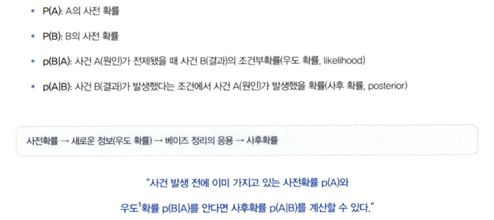

# 통계학 1주차 정규과제

📌통계학 정규과제는 매주 정해진 분량의 『*데이터 분석가가 반드시 알아야 할 모든 것*』 을 읽고 학습하는 것입니다. 이번 주는 아래의 **Statistics_1st_TIL**에 나열된 분량을 읽고 `학습 목표`에 맞게 공부하시면 됩니다.

아래의 문제를 풀어보며 학습 내용을 점검하세요. 문제를 해결하는 과정에서 개념을 스스로 정리하고, 필요한 경우 추가자료와 교재를 다시 참고하여 보완하는 것이 좋습니다.

1주차는 `1부. 데이터 기초체력 기르기`를 읽고 새롭게 배운 내용을 정리해주시면 됩니다.


## Statistics_1st_TIL

### 1부. 데이터 기초체력 기르기
### 01. 통계학 이해하기
### 02. 모집단과 표본추출
### 03. 변수와 척도
### 04. 데이터의 기술 통계적 측정
### 05. 확률과 확률변수
### 06. 확률분포
### 07. 가설검정

## Study Schedule

|주차 | 공부 범위     | 완료 여부 |
|----|--------------|----------|
|1주차| 1부 ~p.79    | ✅      |
|2주차| 2부 ~p.120   | 🍽️      | 
|3주차| 2부 ~p.202   | 🍽️      | 
|4주차| 2부 ~p.299   | 🍽️      | 
|5주차| 3부 ~p.356   | 🍽️      | 
|6주차| 3부 ~p.437   | 🍽️      | 
|7주차| 3부 ~p.542   | 🍽️      | 
|8주차| 3부 ~p.615   | 🍽️      | 
|9주차|데이터 분석 실습| 🍽️      |

<!-- 여기까진 그대로 둬 주세요-->

# 01. 통계학 이해하기

```
✅ 학습 목표 :
* 통계학의 필요성을 안다.
* 기술통계와 추론통계의 특성을 구분하여 이해한다.
```
<!-- 새롭게 배운 내용을 자유롭게 정리해주세요.-->

## 통계학의 필요성

### 1.1 왜 통계학을 알아야 할까?


EDA 과정에서 데이터를 이해 및 해석한다. 이때, 데이터의 분포, 확률, 연관성을 파악한다. 그 후 수많은 테스트와 수정을 반복하여 문제점을 찾아내고 개선 방향을 도출한다.

> 가설 검정 -> 확률분포와 신뢰구간 추정

### 1.2 머신러닝과 전통적 통계학의 차이

머신러닝의 주 목적이 '예측'이라면 통계학의 주 목적은 '해석'이다.

1) 머신러닝

- 분석 모형의 복잡성이 높으며, 고질적인 과적합 문제 해결에 집중한다.
- 예측력이 얼마나 높은지가 중요하다.
- 데이터의 학습과 분류, 예측 자체를 학습하도록 프로그래밍 된 것.

2) 통계학

- 모델의 신뢰도를 중시하며, 단순성을 추구한다.
- 각 변수의 영향력에 대한 해석 + 샘플의 가정(Assumption) + 통계적 적합성
- 확률을 통해 가설을 검증하고 추정 모델을 통해 데이터를 해석하는 데 집중한다.

### 1.4 기술 통계와 추론 통계

1) 기술 통계
- 주어진 데이터의 특성을 사실에 근거하여 설명, 묘사하는 것.
- 기술 = descriptive = 서술(묘사)하는, 사실에 근거한, 설명적인
- 전체 데이터를 쉽고 직관적으로 파악할 수 있도록 설명해주는 것.
- EDA(Exploratory Data Analysis), 탐색적 데이터 분석이라고도 한다.
- 시각화를 많이 활용한다.

2) 추론 통계
- 표본 집단으로부터 모집단의 특성을 추론하는 것.
- 표본에서 구한 통계값을 통해 모수(parameter) 값이 얼마인지(점추정), 특정 구간 내에 존재할 확률이 얼마인지(구간추정)를 추정.
- 추론 = inferential = 추리의, 추정에 의한

<br>
<br>

# 02. 모집단과 표본추출

```
✅ 학습 목표 :
* 모집단과 표본, 모수와 통계량의 정의와 관계를 설명할 수 있다.
* 분석가가 비논리적인 추론을 내리는 패턴인 인지적 편향의 종류를 이해한다.
* 편향과 분산의 차이를 이해한다.
```

<!-- 새롭게 배운 내용을 자유롭게 정리해주세요.-->

### 모집단과 표본


- 모집단 : 분석 대상 전체의 집합 -> 전수조사 : 자료 전체를 조사 및 분석.

- 표본 : 모집단의 부분집합 -> 표본조사 : 표본을 통해 모집단의 정보(평균, 표준편차 등)를 추정하고 검정.
    - 데이터의 형태나 분포에 따라 표본 추출 방법 상이.
    - 다양한 편향과 이상치들을 효과적으로 제거한 표본을 추출해야 함.
    - 즉, 최대한 모집단의 특성을 반영할 수 있는 표본이 좋은 표본.

### 2.3 표본추출에서 나타나는 편향의 종류

- 표본 오차 : 모집단과 표본의 자연 발생적인 변동
- 비표본 오차 : 표본 오차를 제거한 오차 
    - 편향(bias) : 비표본 오차의 원인 중 하나, 표본에서 나타나는 모집단과의 체계적인 차이
        - 표본추출편향
        - 가구편향
        - 무응답편향
        - 응답편향
    - 표본 편향은 '확률화' 등의 방법을 통해 최소화하거나 없앨 수 있다.
    - 확률화 : 모집단으로부터 편향이 발생하지 않는 표본을 추출하는 방법.
        - 이렇게 추출한 표본 : 확률 표본

## 2.4 인지적 편향의 종류

휴리스틱(heuristic)을 통해 왜곡된 지각으로 결정을 하는 경우가 많다.

### 확증 편향
- 자신이 본래 믿고 있는 대로 정보를 선택적으로 받아들이고 임의로 판단하는 편향.
- 자신의 입맛대로 필터링한다.. -> '데이터를 마사지한다.'
- 크로스 체크, 블라인드 분석을 통해 방지

### 기준점 편향
- 가장 처음에 접하는 정보에 지나치게 매몰되는 편향.

### 선택 지원 편향
- 본인이 의사결정을 내리는 순간 그 선택의 긍정적인 부분에 대해 더 많이 생각하고 그 결정에 반대되는 증거를 무시하게 되는 편향.

### 분모 편향
- 분수 전체가 아닌 분자에만 집중하여 현황을 왜곡하여 판단하게 되는 편향.

### 생존자 편향
- 소수의 성공한 사례를 일반화된 것으로 인식함으로써 나타나는 편향.

<br>

### 2.5 머신러닝 모델 측면의 편향과 분산
- 편향 : 예측값들이 정답과 일정하게 차이가 나는 정도
- 분산 : 주어진 데이터 포인트(ex. 평균)에 대한 모델 예측의 가변성.


## 2.6 표본 편향을 최소화하기 위한 표본 추출 방법

### 표본 추출의 두 가지 관점
1) 데이터 수집 단계의 표본 추출
2) 빅데이터에서 분석 모델링을 위한 적절한 크기의 표본데이터를 추출하는 것

### 데이터 수집 단계의 표본추출 단계


### 빅데이터에서의 표본추출 단계
- 표본 추출 방법과 크기만 결정하면 이전 단계와 동일.
- 단, 모집단이 분석 목적에 맞게 구성되어 있는지 확인 필요.

### 표본 추출방법 결정
- 확률 표본추출방법 : 단순 무작위 추출방법, 계층적 표본추출방법, 층화 표본추출방법, 군집 표본추출방법

- 복원추출법 : 표본을 뽑은 후 모집단을 다시 복원시키므로 표본공간은 독립적으로 변화가 없다. 또한, 동일한 표본이 중복으로 선택될 수 있다.
- 비복원추출법 : 표본을 하나 하나 추출하는 행위가 표본공간을 바꾸는 종속사건이 된다. 즉, 표본을 추출하면 다음 표본들의 추출 확률에 영향을 미친다.


<br>
<br>

# 03. 변수와 척도
```
✅ 학습 목표 :
* 독립변수, 종속변수에 대해 이해한다.
* 척도(변수의 데이터적 속성)의 종류를 알아본다.
* 척도에 따라 어떤 분석방법이 적절한지 판단할 수 있다.
```
<!-- 새롭게 배운 내용을 자유롭게 정리해주세요.-->

### 3.1 변수의 종류

변수의 관계적 측면에 따라 '독립변수'(=원인)와 '종속변수'(=결과)로 구분.

- 상관관계 : 두 변수의 수치가 상관성을 갖는 것.

독립변수와 종속변수와의 연관성을 측정하는 것이 목표이므로
독립변수 간에는 상관관계가 없어야 한다.(현실적으로 최소화시킨다.)

- 통제변수 : 실험/설문조사 시 종속변수에 영향을 줄 수 있는 외부 요소를 통제하기 위해 사용되는 변수.

### 3.2 변수 관계의 종류

- 인과관계 : 독립변수와 종속변수의 기본적 관계. ex. y=aX

- 상관관계 : 변수 간 관련성이 존재하는 관계로, 양/음 구분X. 

- 독립관계 : 변수 간 상관성이 없는 관계로, 상관계수가 0이다.
    
    > 상관계수가 0이라고 독립성이 성립하진 않는다.

- 의사관계 : 변수 간 상관성이 존재하나, 다른 변수에 의해 나타난 상관성인 관계.

- 양방향적 인과관계 : 두 변수가 서로 간에 인과적 영향을 미치는 관계.
    
    > ex. 투자 -> 매출 증대 -> 투자 증가 -> 매출 증대 // 투자금-매출액 간 관계.

- 조절관계 : 독립변수와 종속변수 간 강하고 불확정적인 영향을 미치는 관계.

    > ex. 직원들의 업무만족도(독립변수)에 따른 기업 매출(종속변수)의 변화를 알아보자. 이때, '성별'이라는 조절변수를 추가하여 남직원 업무만족도 vs 여직원 업무만족도 비교를 통해 기업매출 변화 관계를 분석할 수도 있다.

- 매개관계 : 조절관계가 독립변수와 종속변수 간 관계의 강도를 조절해준다면, 매개관계는 독립변수의 영향을 종속변수로 (직접) 전달하는 역할을 한다. 

### 척도의 종류


명목 - 서열 - 등간 - 비율 -> 뒤로 갈수록 포함하는 정보의 양이 점점 많아진다.

- 명목척도 : 속성/범주 구분한다.
- 서열척도 : 대상 간의 순서관계를 측정한다. 다만, 간격에 대한 정보는 미포함한다.
- 등간척도 : 서열척도 특징 + '상대적 크기'에 대한 정보. 다만, 절대적인 기준인 영점이 존재하지 않는다.
- 비율척도 : 영점이 존재하며 가감승제(+, -, x, /) 모두 가능하다.


<br>
<br>

# 04. 데이터의 기술 통계적 측정

```
✅ 학습 목표 :
* 산포도의 의미와 산포도를 측정하는 방법에 대해 설명할 수 있다.
* 정규분포의 왜도값과 첨도값이 얼마인지 답할 수 있다.
```

<!-- 새롭게 배운 내용을 자유롭게 정리해주세요.-->

중심성향 -> 평균값, 최빈값, 중앙값

평균 -> 산술평균, 가중평균, 기하평균, 조화평균
    
    - 기하평균이 비율의 평균을 구하는 것이라면 조화평균은 값의 평균을 구하는 것.

아웃라이어/변수값의 붙로가 극단적으로 비대칭인 경우 평균으로 중심성향을 파악하기 힘드므로 중앙값/최빈값 등이 대신 사용된다.

- 중앙값 -> 소득 양극화 문제 해결 가능
- 최빈값 -> 평균/중앙값과는 달리 명목척도나 서열척도로 이뤄진 데이터도 측정이 가능

### 4.2 분산과 표준편차

편차 : 두 점 사이의 거리
if 변수(차원)가 2개 이상일 경우 거리는 ```유클리디안 거리```를 통해 구한다.

유클리디안 거리 : 표준편다와 유사한 방식, # 11.9 참고
결정적으로 평균편차는 미분이 되지 않아 머신러닝 모델에 필수적인 손실함수의 미분을 할 수 없으므로 분산과 표준 편차를 사용.


- 슈하트 관리도 : 월 매출/전체 샘플 중 불량품의 수 등을 측정하여 평균값보다 표준편차의 3배 크기의 차이가 넘게 나면 이상징후로 판단하는 방법.

### 4.3 산포도의 법위, 사분위수, 변동계수

정규분포를 따르지 않거나 산포도가 큰 경우에 사분위수를 자주 사용한다.

- 변동 계수(CV, coefficient of variation) : 표준편차를 산술평균으로 나누어 준 값.
    - 두 자료의 평균이 다를 때, 표준편차만으로는 두 자료의 상대적인 데이터 산포 정도를 측정할 수 없다.
    - 하지만, 변동 계수의 경우 각 자료의 표준편차와 평균을 함께 활용하므로 서로 다른 자료의 산포도를 비교할 수 있다.

### 4.4 왜도와 첨도
### 4.4.1 왜도

왜도 : 데이터 분포의 좌우 비대칭도를 표현하는 척도
- 데이터의 분포가 얼마나 대칭이 아닌지를 나타낸다.
- 한쪽으로 몰릴수록 왜도 값이 커진다.
- 피어슨의 비대칭 계수로 왜도 측정하는 것이 가장 간단

    

    - 평균값, 중앙값, 최빈값 간의 차이를 비교한 후, 그 차이를 표준편차로 나눈 값을 통해 정도를 측정한다.
    - 정규분포 : 0, 왼쪽 : +, 오른쪽 : -
    - 일반적으로 0보다 작거나 3보다 크면 데이터가 정규성을 따르지 않는다 판단.

### 4.4.2 첨도

첨도 : 분포가 정규분포보다 얼마나 뾰족하거나 완만한지의 정도를 나타내는 척도
- 첨도는 중심에 얼마나 집중적으로 쏠려 있는가를 나타낸다.
- 첨도 값이 기준보다 크면 양의 첨도/급첨
- 첨도 값이 기준보다 작으면 음의 첨도/완첨
- 기본 값 : 3 (편의상 0으로 하는 경우도 있음)

    
    정규분포의 첨도 기준이 0인 경우, 첨도가 음수로 작을수록 분포는 넓게 퍼져 있게 되고, 양수로 클수록 뾰족한 형태의 분포를 갖게 된다.

### 4.5 표준편차의 경험법칙 (개인적으로 흥미롭네요 호호호)


경험법칙 : 일반적인 정규분포에서 표준편차를 통해 데이터 값들의 범위를 가늠할 수 있다.
```
데이터의 약 99.7%가 평균으로부터 플마 3 표준편차 이내에 속하므로, 최댓값은 평균 + 3표준편차이고, 최솟값은 평균 - 3표준편차라고 추정이 가능하다. 즉, 데이터의 범위는 표준편차의 약 6배에 해당한다.

하지만, 경험법칙은 통계적으로 표본의 크기가 최소 100 이상은 되어야 성립한다. 30~100 사이에서는 플마 2표준편차가 더 정확하며, 30 미만에서는 적용X.

if 주어진 데이터가 정규분포가 아니거나 분포를 모를 경우에는 Chebyshev's theorem을 적용할 수 있다.

by Chebyshev's theorem
분포의 모양과 상관없이 평균값 플마 2표준편차 범위에 반드시 75% 이상의 데이터가 존재하고, 플마 3 범위에서는 적어도 89%, 플마 4 범위에서는 적어도 94%가 존재한다.
```

<br>

# 05. 확률과 확률변수

```
✅ 학습 목표 :
* 베이즈 정리의 개념을 이해하고 이를 실생활 예제에 적용할 수 있다.
* 심슨의 역설을 경계하여 데이터를 분석할 때 세부 그룹별 패턴을 고려해 잘못된 결론을 방지할 수 있다.
```

<!-- 새롭게 배운 내용을 자유롭게 정리해주세요.-->

> 확률을 통해 표본으로 모수를 추정하는 원리를 파악할 수 있다..!!

### 5.1 확률의 기본 개념
- 확률 : 일정한 조건 안에서 특정 사건이 일어날 수 있는 가능성의 정도
    - 데이터 분석에서 주로 표본을 사용하는데, 표본을 통해 통계치를 산출할 때 어느 정도 오차가 생긴다. 
    - 이때, 오차의 불확실성이 어느 정도인지를 이해하기 위해서는 확률의 개념을 이해해야 한다..!!
- 표본공간 : 통계적 실험을 통해 발생할 수 있는 모든 사건의 집합
- 확률변수 : 측정 값이 변할 수 있는 확률이 주어진 변수

### 5.2 확률의 종류
1. 비조건 확률(unconditional probability)
    - 아무런 조건이 없는 상황에서 사건이 일어날 확률로, 한계확률(marginal probability)이라고도 함.

2. 결합확률(joint probability)
    - 표본공간 안에서 일어나는 사건 각각의 조합으로 이뤄지는 확률로, 두 개 이상의 사건이 동시에 일어나는 확률

3. 조건부 확률(conditional probability)
    - 하나의 사건이 먼저 발생했다는 조건이 전제된 상황에서 또 다른 사건이 발생할 확률
    - 먼저 조건을 주어 표본공간을 한정 지은 다음, 다른 조건의 확률을 구하므로 조건부 확률은 결합확률보다 확률 값이 높게 측정된다.

### 5.3 분할과 베이지안 이론


분할 : 사건들을 모두 합했을 때 전체 사건들을 포괄하되, 중복이 일어나지 않는 사건들의 집합. MECE(Mutually Exclusive, Collectively Exhaustive)


즉, 특정한 사건 A가 발생하면 그 사건의 원인이 되는 사건들의 사전 확률을 이용하여 사건 A의 원인이 될 수 있는 사후확률을 알아낸다.

### 5.5 심슨의 역설

확률이란 요소도 데이터의 정보를 압축하여 보여주는 것이므로 확률의 특성을 고려하지 않으면 잘못된 결과를 도출할 수 있다.

심슨의 역설 : 데이터를 어떻게 나누고 결합하고 가공하는가에 따라 결과가 정반대로 바뀔 수 있음을 경계해야 한다.


# 06. 확률분포

```
✅ 학습 목표 :
* 이산확률분포의 종류에 대해 알고, 각각의 특징과 활용 사례를 설명할 수 있다.
* 연속확률분포의 종류와 특징을 설명할 수 있다. 
* 중심극한정리(CLT)의 개념을 이해하고 설명 할 수 있다.
```

[이산확률분포와 연속확률분포 추가자료](https://velog.io/@tngus0325/%EC%9D%B4%EC%82%B0%ED%99%95%EB%A5%A0-%EB%B6%84%ED%8F%AC%EC%99%80-%EC%97%B0%EC%86%8D%ED%99%95%EB%A5%A0-%EB%B6%84%ED%8F%AC-%EC%A0%95%EB%A6%AC)

## 6.2. 이산확률분포

> **🧚 이산확률분포에 대해 학습한 내용을 정리해주세요.**

<!--수식과 공식을 암기하기보다는 분포의 개념과 특성을 위주로 공부해주세요. 분석 대상의 데이터가 어떠한 확률분포의 특성을 가지고 있는지를 아는 것이 더 중요합니다.-->


## 6.3. 연속확률분포

> **🧚 연속확률분포에 대해 학습한 내용을 정리해주세요.**

<!--수식과 공식을 암기하기보다는 분포의 개념과 특성을 위주로 공부해주세요. 분석 대상의 데이터가 어떠한 확률분포의 특성을 가지고 있는지를 아는 것이 더 중요합니다.-->


## 6.4. 중심극한정리

[중심극한정리 시뮬레이션](https://www.youtube.com/watch?v=aIPvgiXyBMI)

> **🧚 중심극한정리에 대해 학습한 내용을 정리해주세요.**

데이터의 크기가 일정한 양(ex. 30개)을 넘으면, 평균의 분포는 정규분포에 근사한다. 즉, 모집단으로부터 무작위로 표본을 여러 번 추출한 후, 추출된 각각의 표본들의 평균을 분포로 그려보면 정규분포의 형태를 가진다.

표본을 여러 번 추출했을 때, '각각의 표본'평균들의 분포가 정규분포를 이룬다.
> 주의 ! > 표본의 양이 충분하면, 표본의 평균이 모집단의 평균과 유사해진다는 뜻이 아님.

그러나 모집단 분포가 심하게 치우쳐 있거나 극단적인 경우 표본 평균의 정규 분포를 달성하기 위해 더 많은 표본이 필요할 수 있으므로 최대한 많은 표본을 확보하는 것이 바람직하다. 

중심극한정리를 이용하면 모집단의 분포가 어떤 형태를 가지고 있는지 모르더라도 표본을 충분히 추출한다면 표본 평균들의 분포가 정규분포를 이루기 때문에 통계적 추정이 가능해진다. 


# 07. 가설검정

```
✅ 학습 목표 :
* 귀무가설과 대립가설의 개념을 이해하고, 가설을 설정하는 원리를 설명할 수 있다.
* 가설검정의 유의수준과 p값의 의미를 이해하고, p값을 해석하여 귀무가설을 기각할지 여부를 판단할 수 있다.
* 1종 오류와 2종 오류의 차이를 설명하고, 실제 사례에서 어떤 오류를 더 중요하게 고려해야 하는지 분석할 수 있다.
```

<!-- 새롭게 배운 내용을 자유롭게 정리해주세요.-->


<br>
<br>

# 확인 문제

## 문제 1.

> **🧚 어떤 분석 방법이 적절할까요?**
<br>

> 🔍 **Q1. 연속형 변수 간 유사성을 기반으로 그룹을
나누고자 하는 경우**   
Ex1) 고객을 유사한 구매 패턴이나 성향을 가진
그룹으로 나누는 경우   
Ex2) 유사한 주제를 가진 문서들을 같은 그룹으로
분류하는 경우

```
여기에 답을 작성해주세요!
```

<br>

> 🔍 **Q2. 범주형 변수 간 인과관계를 확인하고자 하는 경우**   
Ex1) 광고 유형(A/B 테스트)과 고객 구매 여부 간의
관계를 분석하는 경우     
Ex2) 성별과 특정 질병 유무 간의 연관성을 분석
하는 경우

```
여기에 답을 작성해주세요!
```

<br>

> 🔍 **Q3. 연속형 변수 간 인과관계가 존재하는 경우**   
Ex1) 광고비 지출과 매출 간의 관계를 분석하는 경우     
Ex2) 체중과 혈압 간의 관계를 분석하는 경우

```
여기에 답을 작성해주세요!
```

## 문제 2.

> **🧚Q. (주)다트비의 조일 과장은 이커머스 플랫폼의 마케팅 업무를 담당하고 있다. 최근 회사에서는 배너 광고의 클릭률(CTR)이 기대보다 낮아 최적의 광고 타겟층을 선정하는 프로젝트를 진행 중이다. 조 과장은 광고 효과를 높이기 위해 고민하던 중, 사이트 방문자의 70%가 모바일 유저, 30%가 PC 유저라는 정보를 알아냈다. 그래서 모바일 유저를 타깃으로 배너 광고를 올리면 되겠다 생각했는데 알고 보니 PC 유저의 광고 클릭률(CTR)이 5%로, 모바일 유저의 광고 클릭률(CTR)보다 4%p 높았다. 이런 경우, 모바일과 PC 중 어느 유저층에 집중하여 배너 광고를 올리는 것이 더 효과적일까? (소수점 둘째자리까지 반올림하여 답해주세요.)**

> 💝 **Hint**   
-P(클릭)을 구한다.  
-P(모바일 유저|클릭)과 P(PC 유저|클릭)을 구하고 값을 비교한다.

<!-- 베이즈 정리를 이해하였는지 확인하기 위한 문제입니다. 문제의 답과 풀이를 작성해주세요. 힌트를 참고하셔도 좋습니다.-->

```
여기에 답을 작성해주세요!
```

## 문제 3.

> **🧚Q. 한 대형 병원이 두 명의 외과 의사(A와 B)의 수술 성공률을 비교하려고 한다. 과거 1년간의 데이터를 보면, A 의사의 전체 수술 성공률은 80%, B 의사의 전체 수술 성공률은 90%였다. 이 데이터를 본 병원 경영진은 A 의사의 실력이 B 의사보다 별로라고 판단하여 A 의사의 수술 기회를 줄이는 방향으로 정책을 조정하려 한다.
그러나 일부 의료진은 이 결론에 의문을 제기했다.
그들은 "단순한 전체 성공률이 아니라 더 세부적인 데이터를 분석해야 한다"고 주장했다.**

> **-A 의사의 실력이 실제로 B 의사보다 별로라고 결론짓는 것이 타당한가?   
-그렇지 않다면, 추가로 확인해야 할 정보는 무엇인가?**

<!-- 심슨의 역설을 이해하였는지 확인하기 위한 문제입니다-->

<!-- 정해진 답은 없습니다. 자유롭게 작성해주세요-->

```
여기에 답을 작성해주세요!
```

## 문제 4. 

> **🧚 OX 문제입니다.**

> **다음 명제가 유의수준 5%를 설정한 것과 동일한 의미인지 판단하세요.   
1️⃣ 표본이 귀무가설과 같을 확률이 5% 미만이다.   
2️⃣ 귀무가설이 참일 확률이 5%이다.   
3️⃣ 귀무가설이 참일 때, 극단적인 표본이 나올 확률을 5%로 설정한 것이다.**

<!-- 동일하면 O, 동일하지 않으면 X.-->

```
여기에 답을 작성해주세요!
```

## 문제 5.

> **🧚Q. 다음 중 귀무가설(H₀)을 기각해야 하는 경우는 언제인가요? 정답을 고르고, 그 이유를 간단히 설명해주세요.**

> **1️⃣ 유의수준(α)이 0.05이고, p값이 0.03일 때   
2️⃣ 유의수준(α)이 0.01이고, p값이 0.02일 때**

```
여기에 답을 작성해주세요!
```

### 🎉 수고하셨습니다.