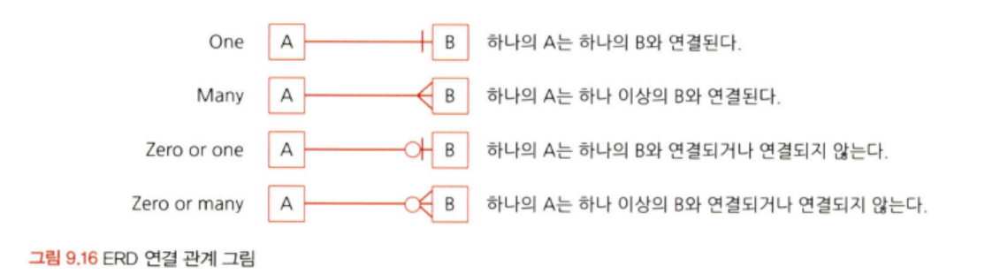

# 통계학 2주차 정규과제

📌통계학 정규과제는 매주 정해진 분량의 『*데이터 분석가가 반드시 알아야 할 모든 것*』 을 읽고 학습하는 것입니다. 이번 주는 아래의 **Statistics_2nd_TIL**에 나열된 분량을 읽고 `학습 목표`에 맞게 공부하시면 됩니다.

아래의 문제를 풀어보며 학습 내용을 점검하세요. 문제를 해결하는 과정에서 개념을 스스로 정리하고, 필요한 경우 추가자료와 교재를 다시 참고하여 보완하는 것이 좋습니다.

2주차는 `2부-08.분석 프로젝트 준비 및 기획`과 `2부-09.분석 환경 세팅하기`를 읽고 새롭게 배운 내용을 정리해주시면 됩니다.


## Statistics_2nd_TIL

### 2부. 데이터 분석 준비하기
### 08. 분석 프로젝트 준비 및 기획
### 09. 분석 환경 세팅하기


## Study Schedule

|주차 | 공부 범위     | 완료 여부 |
|----|--------------|----------|
|1주차| 1부 ~p.79    | ✅      |
|2주차| 2부 ~p.120   | ✅      | 
|3주차| 2부 ~p.202   | 🍽️      | 
|4주차| 2부 ~p.299   | 🍽️      | 
|5주차| 3부 ~p.356   | 🍽️      | 
|6주차| 3부 ~p.437   | 🍽️      | 
|7주차| 3부 ~p.542   | 🍽️      | 
|8주차| 3부 ~p.615   | 🍽️      | 
|9주차|데이터 분석 실습| 🍽️      |

<!-- 여기까진 그대로 둬 주세요-->

# 08. 분석 프로젝트 준비 및 기획

```
✅ 학습 목표 :
* 데이터 분석 프로세스를 설명할 수 있다.
* 비즈니스 문제를 정의할 때 주의할 점을 설명할 수 있다.
* 외부 데이터를 수집하는 방법에 대해 인식한다.
```
<!-- 새롭게 배운 내용을 자유롭게 정리해주세요.-->

## 8.1 데이터 분석의 전체 프로세스

> 데이터 분석의 궁극적인 목표 : 의사결정 프로세스를 최적화하는 것. 

내외부 데이터를 수집 및 전처리하고, 정제된 데이터셋을 만든 후 분석 모형과 알고리즘을 개발하여 결과물을 의사결정에 사용한다.


1. 설계 단계
- 무엇을 하고자 하는지 명확히 정의하고 프로젝트를 수행할 인력을 구성한다.
- 실무자와 분석가 간 협의체계가 잘 이뤄져야 한다.
    - 분석가는 비즈니스 도메인과 데이터에 익숙하지 않은 게 일반적.

2. 분석 및 모델링 단계
- 데이터 분석 및 모델링을 위한 서버 환경 구축.
- 본격적인 데이터 분석과 모델링 진행.
- 데이터 추출, 검토, 가공, 모델링 등의 세부 절차와 부분 반복이 필요.

3. 구축 및 활용 단계
- 최종 선정된 분석 모델을 실제 업무에 적용하고 그 성과를 측정한다.
- 모델 적용 후 기존보다 얼마나 개선됐는지 효과를 측정 및 평가한다. ex) A/B test


### 방법론의 핵심
1. 초반부
- 비즈니스 문제와 해결 방향을 명확히 정의한다.
- 데이터를 탐색한다.

2. 중반부
- 데이터를 목적에 맞게 수집 및 가공한다.
- 필요에 따라 머신러닝 모델을 사용한다.

3. 후반부
- 데이터 분석 결과를 검토 및 검증한다.
- 실제 환경에 적용한다.

4. 그 이후
- 적용한 방법의 효과를 지속적으로 모니터링하며 성과를 측정 및 보완한다.

## 8.2 비즈니스 문제 정의와 분석 목적 도출

> 데이터의 분석 목적 설정하기!
- 채찍 효과 issue
- MECE(Mutually Exclusive Collectively Exhausitve)
    - 로직 트리(Logic Tree)를 활용하여 세부 항목을 정리한다.
    - 세부 항목들은 서로 중복되지 않으면서 상위 항목 전체를 포함하고 있어야 한다.

### 데이터 분석은..

```데이터 분석```은 통계적인 검증을 통해 의미를 찾는 것이며, 통계적인 모델을 구축하기 위해서는 명확한 분석 모델과 변수가 설정되어야 한다. 따라서, 명확한 문제 정의와 분석 시나리오, 분석 모델에 적합한 데이터 수집 및 가공 과정이 필요하다.

```비즈니스 문제```는 현상에 대한 설명으로만 끝나서는 안되며, ```본질적인 문제점```이 함께 전달되어야 한다.


1. 비즈니스가 단순 고객 이탈로 정의되었을 때, 분석 목적은 이탈 고객 예측 모델을 만드는 것이되는 반면,
2. 비즈니스 문제가 고객 이탈에 따른 수익 감소로 정의된다면, 분석 목적은 손해를 최소화할 수 있는 프로모션 최적화 모델을 만드는 것이 됨.

    

    페이오프 매트릭스 : 문제해결 우선순위 결정방식 (1 -> 4 순서로 진행)

> 분석 프로젝트의 방향이 언제든 바뀔 수 있음을 유의한다.

> 실무자들 간의 커뮤니케이션 및 협력이 매우 중요하다.
    
> 초기 데이터 탐색을 통한 간단한 상관관계나 데이터 특성, 시각화 적극 활용한다.

### 도메인 지식

도메인 지식 : 해당되는 분야의 업에 대한 이해도, 세부적으로는 하나의 기업, 하나의 조직 단위에 대한 이해도를 의미함.

데이터 분석의 경우, 분석 자체보다 분석 결과를 활용하는 것이 중요한데 도메인 지식이 없다면 분석 결과가 어떤 의미를 가지는지, 어떻게 활용될 수 있는지 알지 못하는 이슈가 발생한다.

도메인 지식을 효과적으로 습득할 수 있는 방법
1. 순수한 마음가짐으로 궁금증이 모두 풀릴 때까지 실무자에게 마음껏 질문하기!
2. 관련 논문들을 참고하여 해당 도메인에 대한 심도 있는 지식 습득하기!
3. 데이터가 만들어지는 현장 직접 경험하기!(소비자/사용자 입장 경험 메타)

## 8.5 외부 데이터 수집과 크롤링

- 분석 목적을 명확히 정의하고, 이에 맞는 외부 데이터를 찾고 수집해야 한다.
- 다수의 경로에서 다양한 데이터를 한꺼번에 수집한 한 후, 머신러닝 모델이나 분석 목적에 맞게 통합 및 가공하여 비즈니스에 활용한다.


- 전문 데이터 판매 기업으로부터 데이터 구매하기 / MOU 통해 공유하기
- 공공 오픈 데이터 활용하기
- 웹 데이터 크롤링하기

### 크롤링

크롤링은 스크래핑이라고도 부르며, Web 상을 돌아다니며 정보를 수집하는 것을 의미한다.

- 크롤링 : 주어진 웹 페이지 내 모든 링크를 따라가면서 모든 내용을 가져온다.
- 스크래핑 : 웹 페이지에서 원하는 부분의 정보만 가져온다.


<br>

# 09. 분석 환경 세팅하기

```
✅ 학습 목표 :
* 데이터 분석의 전체적인 프로세스를 설명할 수 있다.
* 테이블 조인의 개념과 종류를 이해하고, 각 조인 방식의 차이를 구분하여 설명할 수 있다.
* ERD의 개념과 역할을 이해하고, 기본 구성 요소와 관계 유형을 설명할 수 있다.
```

<!-- 새롭게 배운 내용을 자유롭게 정리해주세요.-->


## 9.2 데이터 처리 프로세스 이해하기


일반적인 데이터 흐름 : OLTP -> DW(ODS) -> DM -> OLAP

### OLTP(On-Line Transaction Processing)
- 실시간으로 데이터를 트랜젝션 단위로 수집, 분류, 저장하는 시스템
- 즉, 데이터가 생성되고 저장되는 처음 단계라고 할 수 있다.

### DW(Data Warehouse)
- 데이터 창고 개념
- 수집된 데이터를 사용자 관점에서 주제별로 통합하여 쉽게 원하는 데이터를 빼낼 수 있도록 저장해 놓은 통합 DB이다.
- 즉, 여러 시스템에 산재되어 있던 데이터들을 한 데 취합해놓은 것.
- ODS(Operational Data Store) : DW에 저장하기 전 임시로 데이터를 보관하는 중간 단계의 저장소
    - DW가 전체 히스토리 데이터를 보관하는 반면, ODS는 최신 데이터를 반영하는 것이 목적이다.

### DM(Data Mart)
- 사용자의 목적에 맞도록 가공된 일부의 데이터가 저장되는 곳.

### ETL
- 데이터의 추출(Extract), 변환(Transform), 불러내기(Load)
- 저장된 데이터를 사용자가 요구하는 포맷으로 변형하여 이동시키는 작업 과정.


## 9.4 테이블 조인과 정의서 그리고 ERD

- 데이터 분석가는 적어도 3개 이상의 테이블을 조합하고 새로 가공하면서 인사이트를 찾아내야 한다.
- 이때, 각 테이블의 속성과 테이블 간의 관계를 명확히 인지하고 있어야 한다.

### 9.4.1 테이블 조인

조인 : 2개 이상의 테이블을 공통의 칼럼을 중심으로 결합하는 것.


- left join & right join
    - 기준이 되는 테이블의 데이터는 그대로 유지하면서 조인하는 테이블의 데이터만 추가되는 것.
    - 일치하는 키 값이 없는 행은 조인하는 테이블의 값이 결측값으로 나타난다.


- inner join
    - 두 테이블 간에 겹치는 부분의 행만 가져오는 조인 방법.
    - 두 테이블 모두 겹치는 행만 나온다.

- full join
    - 모든 행을 살리는 조인 방법
    - 다만, 조인되지 않은 부분은 결측값이 된다.


- cross join
    - 주로 머신러닝에 사용되는 데이터셋 생성 시 사용된다.
    - 값이 없더라도 모든 행이 생기도록 데이터 가공 시 사용한다.
    - ex. 고객별 각 차량의 구매확률을 구하는 모델을 만들 때, 크로스 조인으로 모든 고객과 차량에 대한 행을 생성할 수 있다.

### 9.4.2 데이터 단어사전

> 각 칼럼과 테이블의 이름을 정할 때 체계를 약속한 일종의 사전.

메타데이터 관리 시스템 
- 데이터가 어디에 어떻게 저장되어 있는지, 데이터를 어떻게 사용할 것인지 등을 이해할 수 있도록 데이터에 대한 정보를 관리하는 시스템.
- 메타데이터 : 데이터의 속성, 데이터들 간의 관계를 정의한 데이터.
- 테이블 정의서 : 메타데이터 관리 시스템의 간소화 된 version
    - 단, 데이블 간의 관계 정보는 알 수 없다.

### 9.4.4 ERD


ERD(Entity Relationship Diagram) : 각 테이블의 구성 정보와 테이블 간의 관계를 도식으로 표현한 그림 형태로 구성되어 있다.

- 테이블 = 엔티티(Entity)
- 각 테이블이 어떤 테이블과 어떤 키로 연결되어 있는지 직관적 확인이 가능하다.
- 물리와 논리로 구분된다.
    - 물리
        - DB를 효율적이고 결점 없이 구현하는 것을 목표로 한다.
    - 논리
        - 데이터 사용자 입장에서 테이블 간 매핑에 오류가 없으며 데이터의 정규화가 이뤄진 것.

- 테이블 간 연결을 해주는 '키 칼럼'과 연결 관계인 '식별자'가 ERD의 핵심이다.
    - 키
        - 기본 키 : 테이블에 적재된 각각의 데이터를 유일하게 구분하는 키로, 중복될 수 없으며 결측값을 가질 수 없다.
        - 외래 키 : 다른 테이블과 연결하기 위한 칼럼으로 중복 또는 결측값이 존재할 수 있다. 
        - 슈퍼 키 : 테이블에서 각 행을 유일하게 식별할 수 있는 키 또는 조합된 키
        - 후보 키 : 기본키의 조건인 유일성과 최소성을 만족하나 기본 키가 아닌 키

- 테이블 간에는 1:1, 1:N, N:N 등 다양한 연결 관계가 존재하므로 이러한 관계를 정확히 파악하고 다뤄야 한다.




<br>
<br>

# 확인 문제

## 문제 1.

> **🧚 아래의 테이블을 조인한 결과를 출력하였습니다. 어떤 조인 방식을 사용했는지 맞춰보세요.**

> 사용한 테이블은 다음과 같습니다.

|
---|---|

> 보기: INNER, LEFT, RIGHT 조인

<!-- 테이블 조인의 종류를 이해하였는지 확인하기 위한 문제입니다. 각 테이블이 어떤 조인 방식을 이용하였을지 고민해보고 각 테이블 아래에 답을 작성해주세요.-->

### 1-1. 

```
LEFT JOIN
```

### 1-2. 

```
INNER JOIN
```

### 1-3. 

```
RIGHT JOIN
```

### 1-4. CROSS JOIN을 수행할 경우, 결과 테이블의 행 개수는 몇 개인가요?

<!--위의 그림과 관계없는 문제입니다. CROSS JOIN을 수행하면 테이블의 행의 개수가 몇 개인지 생각해보세요.-->
```
CROSS JOIN은 두 테이블의 모든 행을 서로 곱하는 조인 방식이다.
따라서, 결합하는 각 테이블의 행의 수를 모두 곱한 값이 CROSS JOIN 수행 후 결과 테이블의 행의 수가 된다.

위 예시의 경우 9개의 행과 5개의 행을 가진 두 테이블을 CROSS JOIN하므로 9x5=45 개의 행이 생성된다.
```

## 문제 2.

> **🧚 다음과 같은 요구사항을 반영한 ERD를 설계할 때 엔터티와 주요 관계를 정의하세요.**

```
[시나리오]  

- 한 회사는 직원(Employee)을 관리하며, 각 직원은 직원 ID, 이름, 부서 ID를 가진다.
- 부서(Department)는 부서 ID, 부서명 속성을 가지며, 여러 직원이 한 부서에 속할 수 있다.
- 프로젝트(Project)는 프로젝트 ID, 프로젝트명을 가지며, 한 직원은 여러 프로젝트에 참여할 수 있다.
- 프로젝트 배정(Project_Assignment) 테이블을 통해 직원과 프로젝트 간의 관계를 관리하며, 배정 ID, 직원 ID(FK), 프로젝트 ID(FK), 배정 날짜를 포함한다. 
```

> **질문:   
1️⃣ 주요 엔터티와 그 속성을 정의하세요.   
2️⃣ 엔터티 간의 관계를 정의하세요.**

<!-- ERD에 관한 문제입니다. 엔터티의 정의와 관계 유형을 떠올려보세요.-->

```
1️⃣ 주요 엔터티와 속성

- 직원 테이블 
    - 속성 : 직원 ID, 이름, 부서 ID

- 부서 테이블
    - 속성 : 부서 ID, 부서명

- 프로젝트 테이블
    - 속성 : 프로젝트 ID, 프로젝트명

- 프로젝트 배정 테이블
    - 속성 : 배정 ID, 직원 ID(FK), 프로젝트 ID(FK), 배정 날짜

2️⃣ 엔터티 간의 관계

- 직원 테이블과 부서 테이블 간에 N:1 관계로 연결된다.(-> 여러 직원이 한 부서에 속할 수 있기 때문이다.)

- 직원 테이블과 프로젝트 테이블 간에 1:N 관계로 연결된다.(-> 한 직원이 여러 프로젝트에 참여할 수 있기 때문이다.)

- 프로젝트 테이블과 프로젝트 배정 테이블이 프로젝트 ID를 기준으로 연결된다.
```

### 🎉 수고하셨습니다.