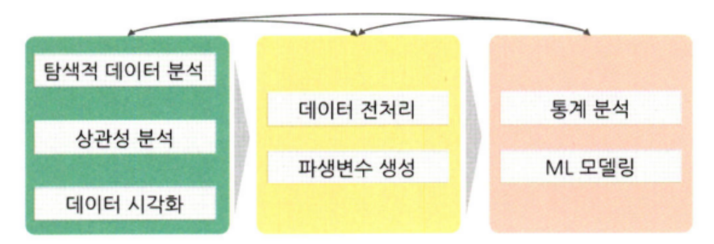
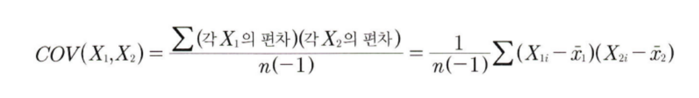
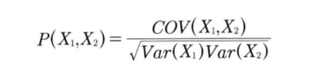
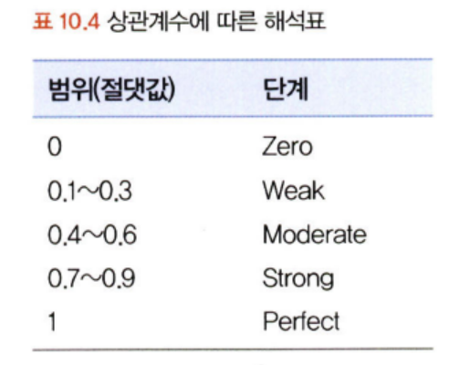
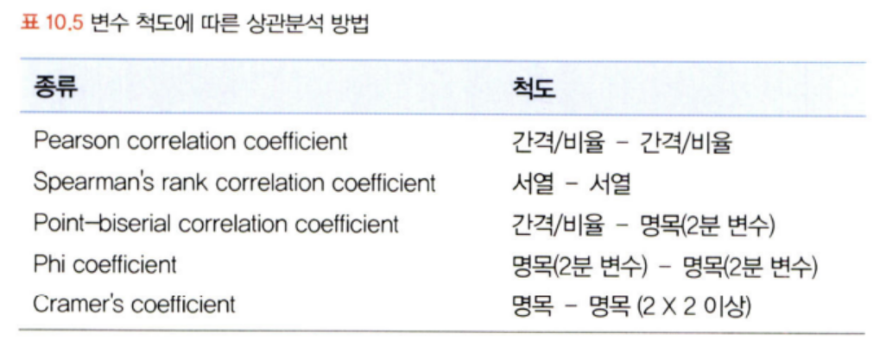

# 통계학 3주차 정규과제

📌통계학 정규과제는 매주 정해진 분량의 『*데이터 분석가가 반드시 알아야 할 모든 것*』 을 읽고 학습하는 것입니다. 이번 주는 아래의 **Statistics_3rd_TIL**에 나열된 분량을 읽고 `학습 목표`에 맞게 공부하시면 됩니다.

아래의 문제를 풀어보며 학습 내용을 점검하세요. 문제를 해결하는 과정에서 개념을 스스로 정리하고, 필요한 경우 추가자료와 교재를 다시 참고하여 보완하는 것이 좋습니다.

3주차는 `2부-10.데이터 탐색과 시각화`를 읽고 새롭게 배운 내용을 정리해주시면 됩니다.

[실습코드](https://github.com/c-karl/DA_DS_Book001)를 참고하여 학습해주세요.


## Statistics_3rd_TIL

### 2부. 데이터 분석 준비하기
### 10. 데이터 탐색과 시각화


## Study Schedule

|주차 | 공부 범위     | 완료 여부 |
|----|--------------|----------|
|1주차| 1부 ~p.79    | ✅      |
|2주차| 2부 ~p.120   | ✅      | 
|3주차| 2부 ~p.202   | ✅      | 
|4주차| 2부 ~p.299   | 🍽️      | 
|5주차| 3부 ~p.356   | 🍽️      | 
|6주차| 3부 ~p.437   | 🍽️      | 
|7주차| 3부 ~p.542   | 🍽️      | 
|8주차| 3부 ~p.615   | 🍽️      | 
|9주차|데이터 분석 실습| 🍽️      |

<!-- 여기까진 그대로 둬 주세요-->

# 10. 데이터 탐색과 시각화

```
✅ 학습 목표 :
* EDA의 목적을 설명할 수 있다.
* 주어진 데이터셋에서 이상치, 누락값, 분포 등을 식별하고 EDA 결과를 바탕으로 데이터셋의 특징을 해석할 수 있다.
* 공분산과 상관계수를 활용하여 두 변수 간의 관계를 해석할 수 있다.
* 적절한 시각화 기법을 선택하여 데이터의 특성을 효과적으로 전달할 수 있다.
```
<!-- 새롭게 배운 내용을 자유롭게 정리해주세요.-->



ML 모델의 성능을 위해서는.. 알고리즘의 우수성/파라미터 최적화 <<< 데이터 파악 및 가공

- EDA의 목적 : 데이터 파악을 효과적으로 하기 위함(시각화를 활용하기도 한다.)
- 데이터 시각화의 목적 : 분석 결과를 커뮤니케이션 하기 위함

## 10.1 탐색적 데이터 분석

탐색적 데이터 분석(Exploratory Data Analysis ; EDA) 
- 가공하지 않은 원천의 데이터를 있는 그대로 탐색하고 분석하는 기법
- 기술통계와 데이터 시각화를 통해 데이터의 특성을 파악하는 것.
- 극단적인 해석은 피해야 하며, 지나친 추론이나 자의적 해석 또한 피해야 한다.

EDA의 주요 목적
```
- 데이터의 형태와 척도가 분석에 알맞게 되어있는지(sanity checking)
- 데이터의 평균, 분산, 분포, 패턴 등의 확인을 통해 데이터 특성 파악
- 데이터의 결측값이나 이상치 파악 및 보안
- 변수 간의 관계성 파악
- 분석 목적과 방향성 점검 및 보정
```

### 10.1.1 엑셀을 활용한 EDA

- 데이터 샘플 막 1,000개 뽑고 엑셀에서 변수 & 칼럼 설명 보면서 쭉 보는 것!
- 다양하고 복잡한 데이터의 대략적 파악이 가능하다.
- Pivot 테이블/그래프 등을 통한 직관적 파악이 가능하다.

### 10.1.2 탐색적 데이터 분석 실습

1. info() -> 칼럼이 문자형인지 숫자형인지, 결측값 등 확인
2. describe() -> 기술통계적 측정
3. 왜도_skew()/첨도 확인_kurtosis() -> 변숫값 분포의 정규성 확인 -> 로그변환/정규화/표준화 등
4. distplot() -> 칼럼의 분포를 시각화

## 10.2 공분산과 상관성 분석

변수 간의 관계 파악
- 타깃 변수 Y와 입력변수 X와의 관계 + 입력변수 X들 간의 관계 살피기
- 다중공선성 방지 및 데이터 이해도 상승 ~!

상관 분석을 위한 기본 가정
1. 데이터가 등간 or 비율 척도이다.
2. 두 변수가 선형적 관계이다.

공분산과 상관계수는 각 변수의 변동이 얼마나 닮았는지 표현한다는 점에선 비슷하나, 계산 방식에 차이가 있다.

공분산 : 서로 공유하는 분산. 두 분산의 관계. 양/음/무



그러나, 공분산은 각 변수 간의 다른 척도기준이 그대로 반영되어 공분산 값이 지니는 크기가 상관성의 정도를 나타내진 못한다. 따라서 정규화를 하여 보완한 것이 ```피어슨 상관계수```다.




주의할 점
```
산점도의 기울기와 상관계수는 관련이 없다!!
분산의 관계성이 같다면, 기울기가 크든 작든 상관계수는 같다.
상관계수가 높다는 것은 정확도, 즉 설명력이 높다는 것이다.

상관관계가 0이더라도 다른 통계적 방법과 패턴이 숨겨져 있으므로 변수 간의 관계 평가 시 다양한 통계적 기법과 시각화 기법을 함께 사용해야 한다.

상관분석의 경우 이상치에 의해 상관도가 크게 달라질 수 있으므로 산점도 그래프를 함께 확인하는 것이 권장된다.
```



## 10.3 시간 시각화


<br>
<br>

# 확인 문제

## 문제 1.
> **🧚 공분산과 상관계수의 차이점에 대해 간단히 설명하세요.**

```
공분산과 상관계수는 각 변수의 변동이 얼마나 닮았는지 표현한다는 점에선 비슷하나, 계산 방식에 차이가 있다.

공분산을 구할 때는 각 변수의 척도 기준의 보정 없이 그대로 반영된다면, 상관계수는 정규화 등의 방식을 통해 척도의 불균형을 맞췄다고 이해할 수 있다.
```

## 문제 2.
> **🧚 다음 데이터 분석 목표에 적합한 시각화 방법을 보기에서 모두 골라 연결해주세요.**

> 보기: 산점도, 선그래프, 막대그래프, 히스토그램, 박스플롯, KDE

(a) 변수의 분포 확인   
(b) 두 변수 간의 관계 확인   
(c) 집단별 평균 비교   
(d) 시계열 데이터 분석

<!--중복 가능-->

```
여기에 답을 작성해주세요!
```


### 🎉 수고하셨습니다.