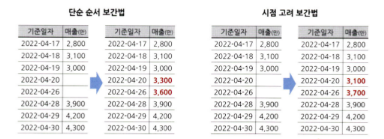

# 통계학 5주차 정규과제

📌통계학 정규과제는 매주 정해진 분량의 『*데이터 분석가가 반드시 알아야 할 모든 것*』 을 읽고 학습하는 것입니다. 이번 주는 아래의 **Statistics_5th_TIL**에 나열된 분량을 읽고 `학습 목표`에 맞게 공부하시면 됩니다.

아래의 문제를 풀어보며 학습 내용을 점검하세요. 문제를 해결하는 과정에서 개념을 스스로 정리하고, 필요한 경우 추가자료와 교재를 다시 참고하여 보완하는 것이 좋습니다.

5주차는 `2부. 데이터 분석 준비하기`를 읽고 새롭게 배운 내용을 정리해주시면 됩니다.


## Statistics_5th_TIL

### 2부. 데이터 분석 준비하기
### 11.데이터 전처리와 파생변수 생성


## Study Schedule

|주차 | 공부 범위     | 완료 여부 |
|----|----------------|----------|
|1주차| 1부 p.2~56     | ✅      |
|2주차| 1부 p.57~79    | ✅      | 
|3주차| 2부 p.82~120   | ✅      | 
|4주차| 2부 p.121~202  | ✅      | 
|5주차| 2부 p.203~254  | ✅      | 
|6주차| 3부 p.300~356  | 🍽️      | 
|7주차| 3부 p.357~615  | 🍽️      | 

<!-- 여기까진 그대로 둬 주세요-->

# 11.데이터 전처리와 파생변수 생성

```
✅ 학습 목표 :
* 결측값과 이상치를 식별하고 적절한 방법으로 처리할 수 있다.
* 데이터 변환과 가공 기법을 학습하고 활용할 수 있다.
* 모델 성능 향상을 위한 파생 변수를 생성하고 활용할 수 있다.
```


## 11.1. 결측값 처리
<!-- 새롭게 배운 내용을 자유롭게 정리해주세요. -->

### 데이터 탐색 단계
- 결측값의 비율
- 한 변수에 결측값이 몰려 있진 않은지
- 빈 문자열이 입력된 것이 결측값으로 인식되지 않았는지

### 결측값
- '.', 'NA', 'NaN'
- 완전 무작위 결측 : 결측값이 무작위로 발생한 경우
- 무작위 결측 : 다른 변수의 특성에 의해 해당 변수의 결측치가 체계적으로 발생한 경우
- 비무작위 결측 : 결측값들이 해당 변수 자체의 특성을 갖고 있는 경우

### 결측값 처리 방법
- 표본 제거 방법
    - 전체 데이터의 10% 미만이 결측치인 경우
    - 결측값이 심히 많은 변수 제거
    - 결측값이 포함된 행 자체 제거
- 평균 대치법
- 보간법
    - 시계열 데이터인 경우
    - 인덱스 간격이 불규칙 or 결측값이 두 번 이상 연달아 있는 경우
    - 데이터를 시간 순으로 정렬렬



- 회귀 대치법
    - 해당 변수와 다른 변수 사이의 관계성을 고려
    - 결측된 변수의 분산을 과소 추정하는 이슈
- 확률적 회귀 대치법
    - 인위적으로 확률 오차항을 추가
    - 표본오차를 과소 추정하는 이슈
- 다중 대치법
    - 단순대치를 여러 번 수행하여 n개의 가상 데이터를 생성하여 이들의 평균으로 결측값을 대치

      

    - 몬테카를로
    - 다중 대치
        - 결측값의 비율이 증가할수록 가상데이터도 많이 생성해야 검정력이 증가

## 11.2. 이상치 처리
<!-- 새롭게 배운 내용을 자유롭게 정리해주세요. -->

### 이상치
- 전체 데이터의 범위에서 크게 벗어난 아주 작거나 큰 극단적인 값을 갖는 것
- 평균/총합 추정에 이슈
- 전체 데이터의 양이 많을수록 튀는 값이 통곗값에 미치는 영향력이 줄어 이상치 제거의 필요성이 낮아짐.

### 이상치 처리 방법
- 이상치 제거(trimming) 
- 관측값 변경 : 하한과 상한 값을 결정한 후 데이터 값 대체
- 가중치 조정 : 이상치 영향 감소시키는 가중치

- MAD(중위수 절대 편차)/중위수
    - 분포가 비대칭인 경우 -n과 +n 표준편차 값을 다르게 설정하기도 함.

> 데이터 변수들의 의미와 비즈니스 도메인을 먼저 이해하고 이상치가 생긴 원인을 논리적으로 생각해야 한다.

- 이상치 변수화하여 설명력 추가


## 11.3. 변수 구간화
<!-- 새롭게 배운 내용을 자유롭게 정리해주세요. -->

### 변수 구간화 
- 이산형 변수를 범주형 변수로 변환

- 이산값 평활화(smoothing) : 단순한 이산값으로 변환
    - 일정 폭/빈도로 구간 나눈 뒤 각 구간에 속한 데이터 값을 평균, 중앙값, 경곗값 등으로 변환
- 클러스터링/의사결정나무
- WOE, IV : 예측력이 얼마나 강한지 나타내는 지표
    - IV > 0.3 : 예측력이 우수한 변수


## 11.4. 데이터 표준화와 정규화 스케일링
<!-- 새롭게 배운 내용을 자유롭게 정리해주세요. -->

### 표준화
- 각 관측치의 값이 전체 평균을 기준으로 어느 정도 떨어져 있는지를 나타냄.

### 정규화
- 데이터의 범위를 0부터 1까지로 변환하여 데이터 분포를 조정함.
- min-max 스케일링

### 표준화 & 정규화
- 서로 단위가 다르거나 편차가 심할 때 값의 스케일을 일정 수준으로 변환시킴.

> 보통의 데이터 마이닝 모델에는 단위가 영향력이 매우 낮으나, 특정 머신러닝 모델의 학습 효율 및 해석적 관점에서 유용

- 정규화는 max=1, min=0으로 직관적인 표현이 가능
- 표준화는 평균에서 얼마나 떨어져 있는지 알 수 있다.

- RobustScaler : 중앙값을 0으로 잡고 Q1과 Q3 사분위수와의 IQR 차이를 1이 되도록 하는 스케일링 기법

- 거리를 활용한 군집 분석(k-Nearest Neighbor, SVM), 범주화 알고리즘 인공신경망에서 필수적


## 11.5. 모델 성능 향상을 위한 파생 변수 생성
<!-- 새롭게 배운 내용을 자유롭게 정리해주세요. -->

### 파생변수
- 원래 있던 변수들을 조합하거나 함수를 적용하여 새로 만들어낸 변수


- 전체 데이터에 대한 파악뿐만 아니라 해당 비즈니스 도메인에 대한 충분한 이해가 수반되어야 한다.

- 데이터의 특성과 흐름을 충분히 파악한 후 아이디어를 얻어서 만드는 것이 효과적이다.

- 다만, 다중공선성 문제가 발생할 가능성이 높으므로, 변수 간 상관성을 확인해야 한다.
    - 파생변수를 그대로 사용할지
    - 기존변수는 제외하고, 파생변수만 사용할지
    - 주성분 분석(PCA)


<br>
<br>

# 확인 문제

## 문제 1. 데이터 전처리

> **🧚 한 금융회사의 대출 데이터에서 `소득` 변수에 결측치가 포함되어 있다. 다음 중 가장 적절한 결측치 처리 방법은 무엇인가?**

> **[보기]   
1️⃣ 결측값이 포함된 행을 모두 제거한다.  
2️⃣ 결측값을 `소득` 변수의 평균값으로 대체한다.  
3️⃣ `연령`과 `직업군`을 독립변수로 사용하여 회귀 모델을 만들어 `소득` 값을 예측한다.  
4️⃣ 결측값을 보간법을 이용해 채운다.**

> **[데이터 특징]**     
    - `소득` 변수는 연속형 변수이다.  
    - 소득과 `연령`, `직업군` 간에 강한 상관관계가 있다.  
    - 데이터셋에서 `소득` 변수의 결측 비율은 15%이다.

```
회귀 대치법
```

## 문제 2. 데이터 스케일링

> **🧚 머신러닝 모델을 학습하는 과정에서, `연봉(단위: 원)`과 `근속연수(단위: 년)`를 동시에 독립변수로 사용해야 합니다. 연봉과 근속연수를 같은 스케일로 맞추기 위해 어떤 스케일링 기법을 적용하는 것이 더 적절한가요?**

<!--표준화와 정규화의 차이점에 대해 고민해보세요.-->

```
표준화
```

### 🎉 수고하셨습니다.